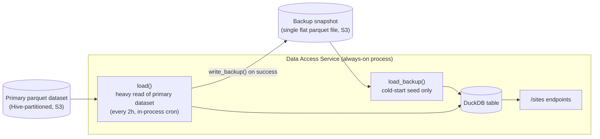
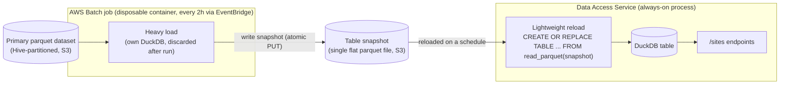

# Sites Parquet Repository — Design Notes

## 1. Current design

**Core flow:** on startup, seed the table from the backup snapshot (`load_backup`) so endpoints work immediately; then do a full heavy load from the primary dataset (`load`) and write a fresh backup (`write_backup`); repeat the heavy load every 2 hours via an in-process cron. `CREATE OR REPLACE TABLE` is atomic, so `/sites` endpoints keep serving a consistent table throughout.

**Issue:** the heavy read of the primary dataset (`load`) runs inside the same always-on process that serves requests, every 2 hours. This is the memory-heavy step, and it competes with request-serving memory in the same process.

## 2. Proposed design

**Core flow:** an EventBridge schedule triggers a Batch job every 2 hours; the job does the heavy read of the primary dataset in its own disposable container and writes the result as one flat snapshot file to S3. The always-on service never reads the primary dataset — it only ever reloads the small flat snapshot on its own schedule, the same cheap `CREATE OR REPLACE TABLE ... FROM read_parquet(...)` it already uses for cold-start seeding today.

**Resolves:** the heavy read no longer runs in the always-on process. Its memory cost is isolated to a short-lived Batch container that is discarded after each run, so it can no longer compete with (or threaten) the API process's memory.
