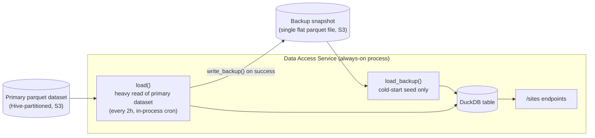
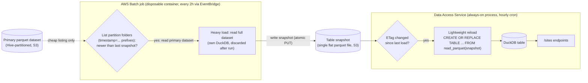

# Sites Parquet Repository — Design Notes

## 1. Current design

**Core flow:** on startup, seed the table from the backup snapshot (`load_backup`) so endpoints work immediately; then do a full heavy load from the primary dataset (`load`) and write a fresh backup (`write_backup`); repeat the heavy load every 2 hours via an in-process cron. `CREATE OR REPLACE TABLE` is atomic, so `/sites` endpoints keep serving a consistent table throughout.

**Issue:** the heavy read of the primary dataset (`load`) runs inside the same always-on process that serves requests, every 2 hours. This is the memory-heavy step, and it competes with request-serving memory in the same process.

## 2. Proposed design

**Core flow:** an EventBridge schedule triggers a Batch job every 2 hours; before doing any heavy reading, the job first lists the primary dataset's partition folders (named `timestamp=<epoch>`, so this is a cheap metadata-only S3 listing, not a data read) to find the latest partition, and compares it against the source timestamp behind the last snapshot it wrote. Only if there's a newer partition does it proceed with the heavy load and write a new flat snapshot file to S3 — otherwise it skips the run entirely. The always-on service never reads the primary dataset — on its own hourly cron, it does a cheap S3 `HEAD` to check if the snapshot's ETag changed since its last load, and only runs the reload (`CREATE OR REPLACE TABLE ... FROM read_parquet(...)`, the same SQL used for cold-start seeding today) when it has.

**Resolves:** the heavy read no longer runs in the always-on process. Its memory cost is isolated to a short-lived Batch container that is discarded after each run, so it can no longer compete with (or threaten) the API process's memory.
