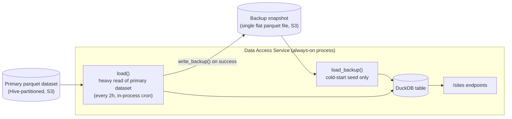
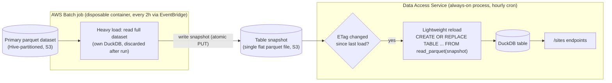

# Sites Parquet Repository — Design Notes

## 1. Current design

**Core flow:** on startup, seed the table from the backup snapshot (`load_backup`) so endpoints work immediately; then do a full heavy load from the primary dataset (`load`) and write a fresh backup (`write_backup`); repeat the heavy load every 2 hours via an in-process cron. `CREATE OR REPLACE TABLE` is atomic, so `/sites` endpoints keep serving a consistent table throughout.

**Issue:** the heavy read of the primary dataset (`load`) runs inside the same always-on process that serves requests, every 2 hours. This is the memory-heavy step, and it competes with request-serving memory in the same process.

## 2. Proposed design

**Core flow:** an EventBridge schedule triggers a Batch job every 2 hours; the job always does the heavy read of the primary dataset and writes a fresh flat snapshot file to S3 — no freshness pre-check, since the primary dataset updates often enough that a pre-check would rarely skip anything and isn't worth the added complexity. The always-on service never reads the primary dataset — on its own hourly cron, it does a cheap S3 `HEAD` to check if the snapshot's ETag changed since its last load, and only runs the reload (`CREATE OR REPLACE TABLE ... FROM read_parquet(...)`, the same SQL used for cold-start seeding today) when it has.

**Trigger mechanism:** a `cron(0 0/2 * * ? *)` CloudWatch Event Rule targeting the Batch job queue/definition directly (`batch_target`), with an IAM role scoped to `batch:SubmitJob` on just that queue/definition — the same pattern already used for pmtiles (`aodn/appdeploy/tf/batch-pmtiles/event_bridge.tf`). Not the newer EventBridge Scheduler service (`aws_scheduler_schedule`) — that resource doesn't support Batch as a target.

**Resolves:** the heavy read no longer runs in the always-on process. Its memory cost is isolated to a short-lived Batch container that is discarded after each run, so it can no longer compete with (or threaten) the API process's memory.

## 3. TODO

The application-code side of this (repository methods, `refresher.py`, `entry_point.py`'s dispatch, the scheduler's hourly reload) is implemented and tested in this repo. Still outstanding, all in `aodn/appdeploy`'s Terraform (or otherwise outside this repo):

- [ ] New Batch job definition + queue for `refresh-sites-parquet`, mirroring `tf/batch-pmtiles/` (same image, `job_command: ["python", "entry_point.py"]`, `job_parameters: {type: refresh-sites-parquet}`).
- [ ] `aws_cloudwatch_event_rule` (`cron(0 0/2 * * ? *)`) + `aws_cloudwatch_event_target` (`batch_target`) + IAM role for `events.amazonaws.com` to `batch:SubmitJob` — same pattern as `tf/batch-pmtiles/event_bridge.tf`. Not the newer EventBridge Scheduler service (doesn't support Batch targets).
- [ ] Wire the new module per environment under `tg/{env}/...`, matching how `pmtiles`/`batch-data-access` are wired today.
- [ ] IAM: give the new Batch job's role write access to the snapshot buckets (`mooring_snapshot`/`wave_buoy_snapshot`); consider narrowing the always-on service's role to read-only there now that it never writes.
- [ ] CI: extend the "sync batch job definition image" deploy step (`.github/workflows/trigger_deploy.yml`) to cover the new job definition, as it does for pmtiles.
- [ ] Local test pass: run `AWS_BATCH_CALL_TYPE=refresh-sites-parquet python entry_point.py` against dev-tier S3 before relying on the Terraform path.
- [ ] At least one real end-to-end run through the actual Batch job definition + EventBridge rule in a non-prod environment before this is considered production-ready (per the test-pyramid discussion — unit tests and local runs don't exercise the container image, job role, or resource limits).
