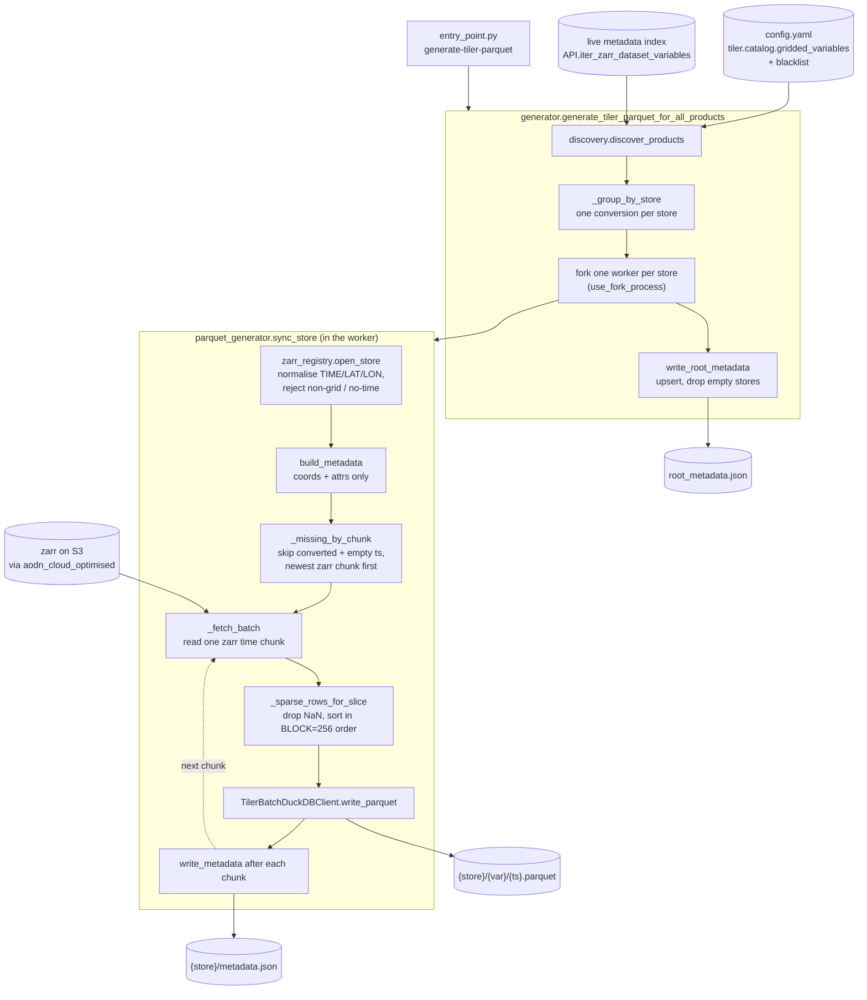
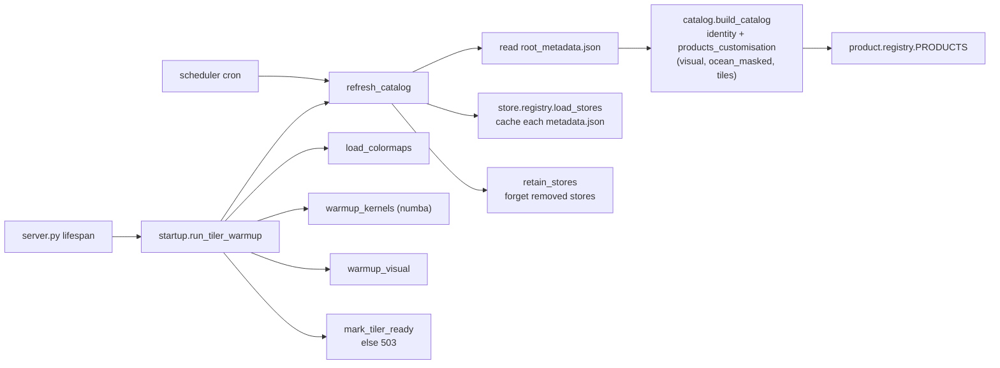
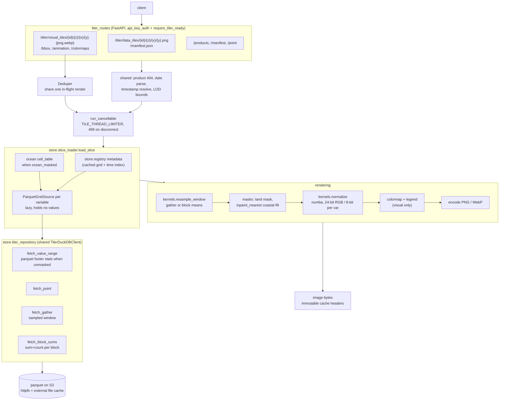

# Tiler architecture

Two independent sides that only meet on S3:

- **Batch** (`batch/tiler/`) converts zarr stores to sparse parquet and publishes
  the catalogue manifest. Runs as an AWS Batch job.
- **API** (`core/tiler_routes/` + `tiler/`) reads those files with DuckDB and
  renders tiles. Never opens a zarr.

The contract between them is the on-S3 layout and the dataclasses in
`models/tiler_parquet_types.py`.

## S3 layout

`tiler_root_dir` is `s3://{datavis_data bucket}/{tiler.config.root_prefix}`.

```
{tiler_root_dir}/
  root_metadata.json                       # catalogue: store -> products
  {store}/metadata.json                    # grid, lat/lon, timestamps, var attrs
  {store}/{variable}/{timestamp}.parquet   # sparse (i, j, value) rows
```

A store is the zarr dataset name minus `.zarr`. One parquet per variable per
timestamp, so a run only adds files and never rewrites them.

## Batch side



Key properties:

- **Incremental.** `metadata.json` lists converted timestamps and all-NaN
  (`empty_timestamps`) ones; both are skipped next run. A grid or variable
  change restarts the store.
- **One store in memory at a time.** Each store runs in a forked child that
  exits when done, so the parent's RSS doesn't accumulate.
- **Block ordering.** Rows are sorted into 256×256 blocks so one parquet row
  group covers a small area and a bbox query skips row groups in both
  directions.
- **Sidecar written after its files**, so a timestamp listed in `timestamps`
  always has parquet behind it.
- `--uuid` limits a run to one metadata record; `max_chunks_per_run` caps work
  per run.

## API side

### Startup and refresh



Rendering config lives only here (`products_customisation`), so changing how a
product looks needs no batch rerun. The scheduler also calls `refresh_stores`
to re-read sidecars and pick up new timestamps.

### Request path



Key properties:

- **Nothing loads a whole slice.** Every read is a DuckDB query sized by what it
  returns: a point, a sampled window, or block sums. `ParquetGridSource` keeps
  no array.
- **Predicate pushdown.** Queries carry an `i`/`j` range so DuckDB skips row
  groups, which is why batch writes in block order.
- **Ocean masking is a SEMI JOIN** against a `(i, j)` cell table built once per
  grid — it can't be applied after aggregation, so it stays in SQL.
- **One DuckDB connection, per-call cursors**, so the request threadpool reads
  concurrently. Arrow tables are registered per cursor.
- `value_range` is LRU-cached (batch never rewrites a file, so it can't go
  stale); reading it in `load_slice` turns a missing file into a 404 before
  rendering starts.
- The numba parallel kernels hold a process lock — the threading layer is not
  thread-safe.

## Tile types

| | data tiles | visual tiles |
|---|---|---|
| Grid | LOD pyramid over the native grid (`get_lod_grids`) | Web Mercator XYZ |
| Output | RGBA PNG encoding raw values for a WebGL shader | colourised PNG/WebP |
| Scalar | 24-bit value in R/G/B, mask in alpha | colormap applied server-side |
| Pair (e.g. UV) | one variable in R, one in G, mask in B | not served (`visual: false`) |
| Decoding | needs `/manifest.json` ranges | none |

`DataTileLodConfig` and `DataTileDefaults` in `config/tiler/constants.py` are
the server↔shader contract — the frontend bakes them into its shader, so
changing one without redeploying the frontend silently corrupts rendering.
