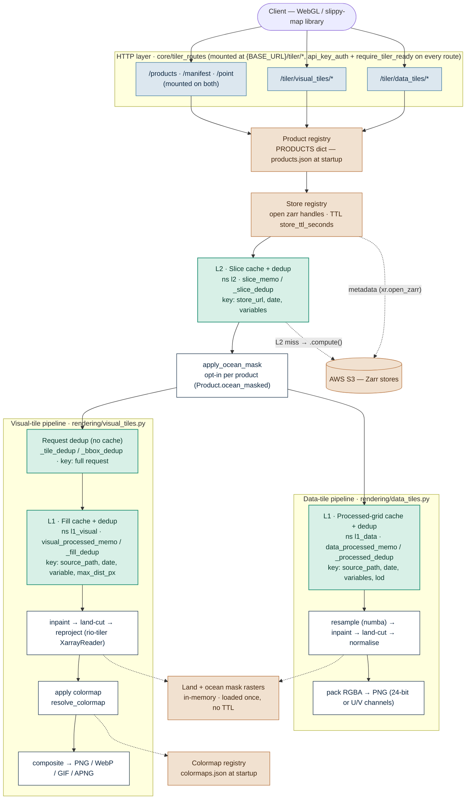

# Technical Reference

## Table of contents

**Part I — Orientation**

1. [Overview](#1-overview)
2. [Why Zarr](#2-why-zarr)
3. [System architecture](#3-system-architecture)
4. [File layout](#4-file-layout)

**Part II — Coordinate systems & API**

5. [Tile coordinate systems and projection pipeline](#5-tile-coordinate-systems-and-projection-pipeline)
6. [URL contract and API surface](#6-url-contract-and-api-surface)

**Part III — Tile generation internals**

7. [Data-tile internals (LOD pyramid + resample + PNG encoding + coastal fill)](#7-data-tile-internals)
8. [Visual-tile internals (CRS guard, antimeridian, colormaps)](#8-visual-tile-internals)

**Part IV — Data conventions**

9. [Date, timezone, and coordinate normalisation](#9-date-timezone-and-coordinate-normalisation)

**Part V — Caching & runtime**

10. [Caching strategy](#10-caching-strategy)
11. [Startup, readiness, and background tasks](#11-startup-readiness-and-background-tasks)
12. [Concurrency: event loop and threading](#12-concurrency-event-loop-and-threading)

**Part VI — Operations**

13. [Adding a new product](#13-adding-a-new-product)
14. [Configuration](#14-configuration)

---

# Part I — Orientation

## 1. Overview

The tiler is a set of FastAPI routers, mounted inside the larger `data-access-service` app (`data_access_service/server.py`), that produce on-demand PNG/WebP tiles for IMOS ocean data products held in Zarr stores on S3. It is not a standalone service — it shares the app's process, event loop, and lifespan with the rest of `data-access-service` (the non-tiler API mounted via `api_router`). Its routes live under `{Config.BASE_URL}/tiler/data_tiles/*` and `{Config.BASE_URL}/tiler/visual_tiles/*` (`BASE_URL = "/api/v1/das"` today) and every one of them requires an `X-API-Key` header — see [§6](#6-url-contract-and-api-surface). This doc uses the shorthand `/data_tiles/...` / `/visual_tiles/...` for readability everywhere else.

**Scope.** The tiler serves **gridded data stored as Zarr** only. Every product is a Zarr store on S3 with a regular lat/lon grid (`time`, `lat`, `lon` dimensions, optionally with a variable axis). Non-gridded data (point observations, vessel tracks, swath/orbit data) and non-Zarr formats (NetCDF, HDF5, COG, GeoTIFF) are out of scope — the entire pipeline, from `load_slice` through the LOD algorithm to the WebGL atlas, assumes a regular gridded Zarr source. See [§2](#2-why-zarr) for _why_ Zarr.

It exposes **two independent tile pipelines** from the same underlying data:

| Pipeline        | Output CRS               | Coordinate convention                                                                                  | Consumer                                                                             |
| --------------- | ------------------------ | ------------------------------------------------------------------------------------------------------ | ------------------------------------------------------------------------------------ |
| `/data_tiles`   | EPSG:4326 (Plate Carrée) | Custom LOD pyramid: `z` = LOD level, `x`/`y` = chunk col/row                                           | WebGL shader (decodes raw values, reprojects on GPU)                                 |
| `/visual_tiles` | EPSG:3857 (Web Mercator) for the `{z}/{x}/{y}` tile endpoint, `/bbox`, and `/animation` alike — see [§5.4](#54-visual-tiles--generated-in-epsg3857-web-mercator) | Standard Web Mercator slippy-map (XYZ) tiles, plus a bbox endpoint and a date-range animation endpoint | Any slippy-map client (MapboxGL, MapLibre, Leaflet, OpenLayers, OSM-style consumers) — all three endpoints are drop-in `raster` sources |

The same Zarr slice is the source for both pipelines; they diverge at the renderer. See [§5](#5-tile-coordinate-systems-and-projection-pipeline) for the full distinction.

Products are static config: they live in `data_access_service/config/tiler/products.json`, committed with the code and loaded once on startup. Adding, removing, or changing a product means editing that file and redeploying — there is no runtime registration API. A missing `products.json` at startup is treated as a broken deploy, not a valid empty state: `load_products()` raises `FileNotFoundError` rather than silently starting with zero products. See [§13](#13-adding-a-new-product).

---

## 2. Why Zarr

The NetCDF/HDF5 stack had an unacceptable cold-start cost for cloud-native serving. HDF5 B-tree traversal requires hundreds of sequential HTTP round-trips regardless of what the application does — it is a file-format constraint, not fixable in the application layer. Observed cold starts from home internet: GSLA SSTA ~30s, Marine Heatwave 90s+ (8m 34s TTFB measured). Even in-region on AWS, Marine Heatwave takes 2–4s on cold start due to its 15 variables × 7.8M-pixel grid.

Zarr eliminates this: metadata is one `.zmetadata`-style HTTP request, and variable chunks are directly addressable with no traversal. The NetCDF stack has been removed from this pipeline.

---

## 3. System architecture

Two pipelines — `/data_tiles/*` and `/visual_tiles/*` — serve the same underlying Zarr stores through mostly-shared machinery (product registry, store registry, L2 slice cache), diverging only at the renderer:



Solid arrows: request/data flow. Dotted arrows: read a shared static asset or fall through to S3, not part of the in-process cache chain.

With the default `cache_backend: none` ([§10](#10-caching-strategy)), every green (cache) node above is a `NullMemoizer` — it never actually retains anything between calls, so every request recomputes past that point. The dedup nodes (`_slice_dedup`, `_processed_dedup`, `_fill_dedup`, `_tile_dedup`/`_bbox_dedup`) still coalesce concurrent identical in-flight requests regardless of backend — see [§10.4](#104-stampede-protection).

### Request flow

**Data tiles** (`/data_tiles/{product_id}/{date}/{z}/{x}/{y}.png`)

`load_slice` is lazy — the route handler passes a callable to `render_tile`, which only invokes it when `_get_processed` misses. On a processed-cache hit, no slice I/O occurs.

```
processed warm → get_lod_grids (already set) → _get_processed (L1 hit)                                → _extract_chunk → PNG encode
slice warm     → get_lod_grids (already set) → _get_processed miss → load_slice (L2 hit)              → resample → L1 populate → _extract_chunk → PNG encode
S3 cold        → get_lod_grids (already set) → _get_processed miss → load_slice (S3 .compute())       → resample → L1 populate → _extract_chunk → PNG encode
```

**Visual tiles** (`/visual_tiles/{product_id}/{date}/{z}/{x}/{y}.{ext}` or `/bbox.{ext}` — `ext ∈ {png, webp}`)

No full-render cache. Every request calls `load_slice`, optionally hits the fill cache if `coastal_fill` is set, then `XarrayReader` reprojects to Web Mercator.

```
mem warm  → load_slice (L2 hit)         → fill cache hit or compute (only if coastal_fill set) → _to_scalar_parts (antimeridian split if needed) → XarrayReader.tile/part → colormap + encode
S3 cold   → load_slice (S3 .compute())  → fill cache hit or compute (only if coastal_fill set) → _to_scalar_parts → XarrayReader.tile/part → colormap + encode
```

With the default `cache_backend: none`, "processed warm", "slice warm", and "fill cache hit" describe what _would_ happen with a cache backend implemented — today every request recomputes past L2, since `NullMemoizer` retains nothing. See [§10](#10-caching-strategy) for the full cache-layer breakdown and [§12.6](#126-a-real-cold-path-finding-chunk-over-read) for a documented cold-path slowness on one production store.

---

## 4. File layout

```
data_access_service/
  server.py                       ← FastAPI app; mounts api_router + tiler_router; shared lifespan
  config/
    config.py                     ← Config / TilerConfig dataclasses, get_tiler_config()
    config.yaml, config-*.yaml    ← per-environment settings, including the `tiler:` block — see §14
    tiler/
      constants.py                ← LOD (DataTileLodConfig: max_lods, min_coarsest) + TILE (chunk_px, padding defaults) + COORD_NAMES
      paths.py                    ← PRODUCTS_CONFIG_PATH, COLORMAPS_CONFIG_PATH, LAND_MASK_PATH, OCEAN_MASK_PATH
      http_cache.py                ← IMMUTABLE_CACHE_HEADERS / REVALIDATE_CACHE_HEADERS + ETag helpers — see §6
      products.json                ← static product config, committed with the code — see §13
      colormaps.json               ← static custom-colormap config, committed with the code
  core/
    tiler_routes/
      __init__.py                 ← mounts data_tiles + visual_tiles routers under {Config.BASE_URL}/tiler/*, with api_key_auth + require_tiler_ready on every route
      shared.py                   ← PRODUCT_EX/DATE_EX examples, get_product_or_404, load_slice_or_404,
                                     validate_date, resolve_colormap_or_error, single_variable_or_400,
                                     parse_rescale, mark_tiler_ready/require_tiler_ready — see §11
      products.py                  ← /products, /manifest, /{id}/{date}/point — included by both tile routers
      data_tiles.py                ← /data_tiles — raw value-encoded RGBA tiles for WebGL
      visual_tiles.py              ← /visual_tiles — colourised Web Mercator XYZ tiles + bbox + animation + colormaps/legend
      startup.py                   ← run_tiler_warmup() — the tiler's startup sequence, see §11
  tiler/
    schemas/
      products.py                  ← ProductConfig (validated products.json entry + GET /products shape), ManifestResponse, PointResponse
      data_tiles.py                ← DataTileManifestResponse (manifest.json shape)
      visual_tiles.py              ← ColormapListResponse
    services/
      caching/
        slice_cache.py             ← L2 CacheBackend wiring (slice_memo, ns "l2") — see §10.3
        processed_cache.py         ← L1 CacheBackend wiring (data_processed_memo ns "l1_data", visual_processed_memo ns "l1_visual") — see §10.2
        deduper.py                 ← Deduper — in-process in-flight dedup, always on regardless of CACHE_BACKEND
        memoizer.py                ← CacheBackend interface + NullMemoizer + create_memoizer() backend selection
      colormap/
        registry.py                ← colormaps.json read + in-memory colormap registry + ColormapMode
        resolver.py                ← resolve_colormap() — custom→rio-tiler→matplotlib fallback chain
        legend.py                  ← render_legend() — color bar + tick labels
        categorical.py              ← CF flag_values helpers (is_categorical_variable, parse_flag_values_and_meanings)
      product/
        product.py                  ← Product dataclass (+ DataTileConfig/VisualTileConfig/CoastalFill) + LOD algorithm + get_lod_grids lazy-init
        registry.py                  ← PRODUCTS dict + load_products + get_product / iter_products / iter_product_items facades
        manifest.py                  ← render_manifest() — bounds + per-variable ranges + LOD meta for manifest.json
      rendering/
        kernels.py                   ← numba JIT bilinear/nearest resample + normalize kernels + xr.interp fallback + warmup_resample
        data_tiles.py                 ← render_tile() — processed-grid compute/cache + chunk extract + RGBA pack + PNG encode
        visual_tiles.py               ← render_tile / render_bbox / render_bbox_animation — Web Mercator (visual tiles)
        masks.py                      ← inpaint_nearest, land_mask_for_grid/land_mask_for_coords, apply_ocean_mask
      store/
        registry.py                   ← StoreRegistry (stale-while-revalidate) + per-URL date index + get_available_dates
        slice_loader.py                ← load_slice / load_slice_uncached — fetch a 2-D slice from the Zarr store
        spatial.py                     ← bbox_to_wgs84 + native_resolution_in_bbox + default_bbox_from_store
    utils/
      dates.py                        ← LOCAL_TZ + ts_to_local_date
      geo.py                           ← dataset_bounds + json_safe_float
      colors.py                       ← hex parsing + ramp/categorical LUT builders
      image.py                        ← encode_rgba(arr, fmt) + empty_tile(fmt) + media_type(fmt) — PNG/WebP encoders shared by both renderers
    assets/
      land_mask.npz                   ← committed Natural Earth land mask (coastal fill) — see §7.6
      ocean_mask.npz                  ← committed ocean-validity mask — see §7.6
    caching_redis_plan.md               ← current caching state + Redis/ElastiCache backend plan (meeting brief)
    technical.md                       ← this file
tests/
```

These paths are constants in `data_access_service/config/tiler/paths.py`, resolved relative to the package (not the CWD) since they're static assets shipped with the code, not runtime-writable state:

| Constant                | Default                       | Notes                                                                                                          |
| ----------------------- | ----------------------------- | -------------------------------------------------------------------------------------------------------------- |
| `PRODUCTS_CONFIG_PATH`  | `config/tiler/products.json`  | Committed with the code; edit + redeploy to add/remove/change a product — see [§13](#13-adding-a-new-product). |
| `COLORMAPS_CONFIG_PATH` | `config/tiler/colormaps.json` | Same as above, for custom colormaps.                                                                           |
| `LAND_MASK_PATH`        | `tiler/assets/land_mask.npz`  | Committed coastline raster used by coastal fill; see [§7.6](#76-coastal-fill-sparse-products).                 |
| `OCEAN_MASK_PATH`       | `tiler/assets/ocean_mask.npz` | Committed valid-domain raster used by the ocean-validity mask; see [§7.6](#76-coastal-fill-sparse-products).   |

**Configuration note.** There is no `.env` file. Operational knobs live under the `tiler:` block of `config/config.yaml` (and the per-environment `config-{dev,staging,edge,prod}.yaml` overlays), read once into a `TilerConfig` dataclass via `Config.get_config().get_tiler_config()`. To change a value, edit the YAML and restart the server. See [§14](#14-configuration).

---

# Part II — Coordinate systems & API

## 5. Tile coordinate systems and projection pipeline

The server produces tiles in **two different coordinate reference systems** depending on the endpoint. The two pipelines share the URL shape `/{product_id}/{date}/{z}/{x}/{y}.{ext}` but interpret `z`, `x`, `y` in entirely different coordinate systems. Mixing them up is the most common cause of "why is my tile blank / 404 / off-by-one" bugs.

### 5.1 Which API should I use?

- Building a normal map with Mapbox GL, MapLibre, Leaflet, OpenLayers, etc., and you just need pretty raster tiles overlaid on a base map → **`/visual_tiles`**.
- Building a custom WebGL visualisation where the client needs the raw scientific values (dynamic colour ramps, client-side analysis, particle animation on UV data) → **`/data_tiles`**.

### 5.2 Two pipelines, two CRSs

|                                 | `/data_tiles`                                                                       | `/visual_tiles`                                                                                                    |
| ------------------------------- | ----------------------------------------------------------------------------------- | ------------------------------------------------------------------------------------------------------------------ |
| **Output CRS**                  | EPSG:4326 (Plate Carrée)                                                            | EPSG:3857 (Web Mercator)                                                                                           |
| **`z` meaning**                 | LOD index (`1` = coarsest, `N` = finest)                                            | Zoom level (`0` = whole world; each step doubles tiles per axis)                                                   |
| **`(x, y)` reference frame**    | Product's own extent (NW corner = `0, 0`)                                           | Whole world (Web Mercator origin = `0, 0`)                                                                         |
| **`(x, y)` range at level `z`** | `0` to `lod_grids[z] − 1`                                                           | `0` to `2^z − 1`                                                                                                   |
| **Out-of-range `(z, x, y)`**    | HTTP 404                                                                            | HTTP 400 (invalid coords, `z > 24` or out-of-range `x`/`y`); transparent 256×256 image (in-range but outside data) |
| **Pixel content**               | Raw value packed into RGBA bytes (24-bit normalised uint or two 8-bit U/V channels) | Colourised RGBA image after applying a colormap LUT                                                                |
| **Reprojection happens…**       | In the **WebGL fragment shader** on the client, on the GPU                          | On the **server**, by `rio-tiler`'s `XarrayReader.tile(...)`                                                       |
| **Multi-variable support**      | Yes (UV products such as `ucur+vcur`)                                               | No (single-variable products only; enforced by `single_variable_or_400`)                                           |
| **Per-tile decode manifest**    | Required (`/{product_id}/{date}/manifest.json`)                                     | Not applicable                                                                                                     |
| **Extra non-tile endpoints**    | —                                                                                   | `/bbox` (arbitrary region), `/animation` (date-range GIF/APNG/WebP)                                                |

This table describes the `{z}/{x}/{y}` tile endpoints specifically. `/bbox` and `/animation` output the same **EPSG:3857 (Web Mercator)** by default, since their `?crs=` query parameter defaults to `EPSG:3857` — see [§5.4](#54-visual-tiles--generated-in-epsg3857-web-mercator) for how `?crs=` drives both the input bbox's coordinates and the output projection together.

The data-tiles `z` axis indexes a **custom LOD pyramid** anchored to the product's own extent — see [§7](#7-data-tile-internals) for the algorithm that derives the pyramid from each Zarr store's dimensions.

#### `data_tiles` — `z`/`x`/`y` semantics

`z` selects a **resolution level**, not a map-zoom level. The valid values are the keys of `product.data_tile.lod_grids` (up to `LOD.max_lods`, default 4); `z = 1` is the coarsest, `z = N` is native data resolution. The LOD grids are derived lazily, on first request, from each Zarr store's actual lat/lon dimensions and the product's `chunk_px` (default `(240, 192)`, from `config/tiler/constants.py`'s `TILE`).

`x` and `y` are chunk column/row within the LOD grid: `x = 0` is the westernmost column, `y = 0` is the northernmost row. Valid range at LOD `z` is `0 ≤ x < grid_cols` and `0 ≤ y < grid_rows`, where `(grid_cols, grid_rows) = product.data_tile.lod_grids[z]`. Requesting outside this range, or an out-of-range `z`, returns **HTTP 404**. Clients are expected to fetch the manifest first so they know each LOD's grid dimensions.

#### `visual_tiles` — `z`/`x`/`y` semantics

`z`, `x`, `y` are **standard Web Mercator slippy-map tile coordinates** — identical to OpenStreetMap, MapboxGL, MapLibre, Leaflet, and OpenLayers (the OGC `WebMercatorQuad` well-known TileMatrixSet, levels 0–24, enforced by the router's `_MAX_ZOOM = 24`). At zoom `z`, the world is divided into a `2^z × 2^z` grid; `x = 0` is the leftmost column, `y = 0` is the topmost row. Valid range is `0 ≤ x, y ≤ 2^z − 1`. Out-of-range coordinates (e.g. `x = 2^z`, or `z` outside `0..24`) return **HTTP 400** — the URL is malformed. In-range tiles that fall **outside the product's data extent** return a **transparent 256×256 image** (not an error), so clients can request a full world grid without first checking the data bounds.

### 5.3 Data tiles — generated in EPSG:4326 (Plate Carrée)

Source Zarr data lives on a regular lat/lon grid. Data tiles preserve that grid exactly: longitude maps linearly to pixel X, latitude maps linearly to pixel Y. This is Plate Carrée — the visual representation of EPSG:4326 / WGS84 geographic coordinates.

The projection is implemented implicitly in `resample_variables_to_grid` (`services/rendering/kernels.py`), whose numba path and `xr.interp` fallback both follow the same mapping:

```python
target_lons = np.linspace(lon_min, lon_max, total_w)  # lon → x (linear in degrees)
target_lats = np.linspace(lat_max, lat_min, total_h)  # lat → y (linear, north→south)
```

`np.linspace` distributes points evenly in degrees — that linear mapping **is** Plate Carrée. No projection formula is needed. Tiles are slices of the native lat/lon data grid with no reprojection on the server.

The manifest returns geographic bounds (`lonMin`, `lonMax`, `latMin`, `latMax`) in degrees, not projected metres.

**Why EPSG:4326 for data tiles**

- Source Zarr data is already on a regular lat/lon grid — tiles map directly with no reprojection overhead.
- Raw scientific values are preserved exactly; resampling is the only transform applied.
- Standard for oceanographic datasets (IMOS, ERA5, CMIP6 all use regular lat/lon grids).
- A reprojection on the server side would either lossy-resample again or require per-tile inverse-Mercator math — both wasteful when the WebGL shader can do the equivalent operation on the GPU at zero marginal cost per fragment.

### 5.4 Visual tiles — generated in EPSG:3857 (Web Mercator)

`services/rendering/visual_tiles.py` calls `XarrayReader.tile(x, y, z, reproject_method=...)` (bilinear for continuous variables, nearest for categorical — see [§8.3](#83-colormap-system)). The reader internally:

1. Reads the source slice (already tagged `EPSG:4326` via `da.rio.write_crs("EPSG:4326")`).
2. Computes the Web Mercator footprint of the target tile from `(x, y, z)`.
3. Reprojects the relevant 4326 region into a 256×256 Mercator-grid array.
4. Returns the array, which the renderer then rescales (per `rescale` or auto-derived min/max), maps through the colormap LUT, and encodes as PNG/WebP.

Because the tile output is already in Web Mercator, `/{z}/{x}/{y}.{ext}` works directly with any map library that consumes XYZ Web Mercator tiles — MapboxGL `raster` sources, Leaflet, OpenLayers, etc. **No client-side reprojection is required.**

**`/bbox.{ext}`'s `?crs=` query parameter controls both the input bbox's coordinates and the output image's projection — the same value drives both, matching the OGC WMS `SRS`/`CRS` convention.** The route (`_parse_bbox_and_crs` in `core/tiler_routes/visual_tiles.py`) validates and uppercases `crs` once, then uses it two ways:

- **As `bounds_crs`**, to interpret the caller-supplied bbox *input* numbers via `bbox_to_wgs84` (`services/store/spatial.py`) — `EPSG:4326` degrees or `EPSG:3857` metres — before converting to WGS84 for cropping. When `bbox` is omitted, this is forced to `EPSG:4326` regardless of `crs`, because `default_bbox_from_store`'s native bounds are always WGS84.
- **As `dst_crs`**, passed straight through to `XarrayReader.part(bbox_wgs84, dst_crs=dst_crs, width=..., height=..., reproject_method=...)` (`_bbox_parts_to_rgba` / `render_bbox` in `services/rendering/visual_tiles.py`) to set the *output* projection — independent of whether `bbox` was omitted.

`crs` defaults to `EPSG:3857`, so a request with no `crs` argument gets a genuine Web Mercator reprojection (pixels evenly spaced in Web Mercator metres) — a drop-in raster source for MapboxGL/MapLibre/Leaflet/OpenLayers `raster` layers, the same as the `{z}/{x}/{y}` tile endpoint. Passing `crs=EPSG:4326` instead switches both legs: the bbox input is read as geographic degrees, *and* the output becomes a Plate-Carrée crop — useful for non-slippy-map consumers that want geographic-degree pixel spacing (e.g. further scientific processing).

`/animation` (`render_bbox_animation`) takes the same `crs` (as `bounds_crs`) and `dst_crs` split, so every animation frame follows the same rule.

**Unit guard (`_validate_bbox_for_crs`).** Because a single `crs` value now governs both legs, a caller who gets the units wrong for one of them (e.g. degree-scale numbers under `crs=EPSG:3857`, since that's now the default) would otherwise get a silently wrong crop rather than an error. `_validate_bbox_for_crs` rejects with `400` before rendering:

- **`crs=EPSG:4326`**: latitude outside `[-90, 90]` — catches real Web Mercator metre values (which run into the millions) passed as degrees.
- **`crs=EPSG:3857`, world-extent check**: any coordinate outside `±20,037,508.34` metres — catches degree values large enough to already be out of range.
- **`crs=EPSG:3857`, magnitude check (`_looks_like_degrees`)**: rejects if *every* coordinate individually falls within plausible lon/lat range (`lon` in `[-180, 360]`, `lat` in `[-90, 90]`). This is a magnitude check, not a span check — an earlier version used a minimum-span threshold, but a wide degree bbox like `-180,-90,180,90` (span 360°×180°) has plenty of "span" as fake metres and would slip past that. Checking each coordinate's own plausible range instead catches degree-scale bboxes regardless of span: a genuine Web Mercator bbox with every coordinate this small describes a crop sitting within a few hundred metres of the map's origin (0°N, 0°E) — not a realistic request against this service's IMOS ocean products. This is exactly the failure mode of omitting `crs` with a degree bbox now that the default is `EPSG:3857`: without this guard, the request wouldn't error on CRS validity, it would silently crop a sliver near null island instead of the intended region.

### 5.5 Frontend integration

- **Visual tiles** plug straight into a `raster` source — no shader and no per-frame math.
- **Data tiles** are sampled by a custom **WebGL fragment shader**. The shader does the work the server intentionally skipped: for each fragment's Mercator position it computes the inverse Mercator to recover `(lon, lat)`, then samples the Plate-Carrée atlas via a linear lat/lon lookup — matching the server's `np.linspace` mapping. Value decoding (uint24 → float via the manifest's `valueRange`) and colour-ramp lookup happen in the same pass.

### 5.6 The manifest is the contract between server and shader

The manifest (data-tile pipeline only, `DataTileManifestResponse` in `schemas/data_tiles.py`) is the interface between the server's coordinate system and the WebGL shader's uniforms:

| Manifest field                             | Purpose                                                                        |
| ------------------------------------------ | ------------------------------------------------------------------------------ |
| `bounds.lonMin/lonMax/latMin/latMax`       | geographic extent for tile sampling                                            |
| `lods[n].grid`                             | cols × rows per LOD for chunk lookup                                           |
| `lods[n].chunkPx` / `storedPx` / `padding` | chunk size and its padded on-disk size, to skip the padding border in atlas UV |
| `valueRange`                               | decode uint24 back to raw value (scalar products)                              |
| `uRange` / `vRange`                        | decode U/V bytes back to raw values (UV products)                              |
| `flagValues` / `flagMeanings`              | discrete codes + labels (categorical variables only)                           |

For a **categorical** variable (one declaring CF `flag_values`), the manifest additionally carries `flagValues` (the discrete integer codes) and, when present and aligned 1:1, `flagMeanings` (their labels). `valueRange` is still emitted. These let a client decode and label raw categorical tiles without a second request. `None` fields are dropped from the response (`response_model_exclude_none=True`).

There is no per-LOD zoom-threshold field in the manifest today — the client is responsible for its own map-zoom → LOD mapping policy.

---

## 6. URL contract and API surface

`z`/`x`/`y` mean different things in each tile API — see [§5](#5-tile-coordinate-systems-and-projection-pipeline).

**Mount path and auth.** Every path below is relative to the actual mount point: `{Config.BASE_URL}/tiler/data_tiles/...` and `{Config.BASE_URL}/tiler/visual_tiles/...` (`core/tiler_routes/__init__.py`), where `BASE_URL = "/api/v1/das"` today — e.g. the data-tile endpoint's real path is `GET /api/v1/das/tiler/data_tiles/{product_id}/{date}/{z}/{x}/{y}.png`. This doc uses the shorthand `/data_tiles/...` / `/visual_tiles/...` throughout to keep examples readable. **Every tiler route also requires an `X-API-Key` header** — the whole `tiler_router` carries `dependencies=[Depends(api_key_auth), Depends(require_tiler_ready)]`, so a request is rejected with `401` (wrong/missing key, `utils/api_utils.py`) or `503` (tiler still starting up, [§11.3](#113-readiness-gate)) before it ever reaches a route handler.

**HTTP caching.** All tile-shaped bytes (`.png`/`.webp`/`.gif`/`.apng`, manifest, point) are served with `IMMUTABLE_CACHE_HEADERS` (`config/tiler/http_cache.py`): `Cache-Control: public, s-maxage=31536000, max-age=0, must-revalidate` — a year at the CDN, `must-revalidate` on the browser (relying on `s-maxage` so CloudFront still serves cached bytes for a year). This works because every such URL is fully determined by its path — the date is in the URL, so once a date's data exists the URL → bytes mapping never changes; there is no separate cache-busting version constant. Listing endpoints whose body can change without the URL changing (`/products`, `/manifest`, `/colormaps`) instead use `REVALIDATE_CACHE_HEADERS` (`max-age=300, must-revalidate`) plus an `ETag`/`If-None-Match` 304 short-circuit (`compute_etag`/`etag_response`).

**Response compression.** `configure_gzip_middleware` (`core/middleware.py`, applied in `server.py`) adds Starlette's `GZipMiddleware` (`minimum_size=1000`, `compresslevel=5`) app-wide — this targets the JSON endpoints above (`/manifest`, `/products`, `/colormaps`), where large date arrays compress well. Image tiles (PNG/GIF/WebP/APNG) are excluded: they're already compressed, so re-gzipping them is pure CPU waste on the hot tile path. The exclusion works by appending `"image/"` to Starlette's `DEFAULT_EXCLUDED_CONTENT_TYPES`; `tests/test_server.py::test_gzip_skips_image_tiles` fails loudly if a Starlette upgrade ever drops that behaviour.

### 6.1 Shared endpoints (mounted under both `/data_tiles` and `/visual_tiles`)

`core/tiler_routes/products.py` is included by both tile routers, so these paths exist under both prefixes:

```
GET /{prefix}/products                                          → list all registered products
GET /{prefix}/manifest?from=YYYY-MM-DD&to=YYYY-MM-DD             → available dates for all products
GET /{prefix}/{product_id}/{date}/point?lat=&lon=                → variable value(s) at one date, nearest grid cell
```

`/manifest` parameters:

| Parameter | Default                                | Description                       |
| --------- | -------------------------------------- | --------------------------------- |
| `from`    | each product's earliest available date | Start date inclusive (YYYY-MM-DD) |
| `to`      | unbounded                              | End date inclusive (YYYY-MM-DD)   |

```json
{
  "products": {
    "model_sea_level_anomaly_gridded_realtime:gsla": {
      "available_dates": ["2024-02-01", "2024-02-02"],
      "full_date_range": { "start": "2011-01-01", "end": "2024-02-28" }
    }
  }
}
```

`available_dates` is the `from`/`to`-filtered list. `full_date_range` is the product's full dataset bounds (earliest/latest available date) **independent of the filter**, so a client can show the full extent of a product while only listing the slice it asked for. Both `start` and `end` are `null` when the product has no dates at all.

**Performance**: dates are read from the `time` coordinate of each Zarr store — a 1-D array held in the store singleton, resolved via its per-URL `{local_date: [timestamps]}` index. No spatial data chunks are touched.

**`GET /products`** returns one `ProductConfig` (`schemas/products.py`) per registered product, built from the live `Product` via `ProductConfig.from_product` — so it reflects resolved defaults (e.g. `ocean_masked`) rather than only what `products.json` literally spells out. `lod_grids` is deliberately excluded (computed lazily from the store, not config — see [§13](#13-adding-a-new-product)).

**`/point` cache headers — immutable**, same rationale as tile endpoints: the date is in the path, so the URL → bytes mapping is pinned once that date's data exists.

### 6.2 Data tiles (`/data_tiles`)

```
GET /data_tiles/{product_id}/{date}/{z}/{x}/{y}.png       → raw RGBA PNG tile
GET /data_tiles/{product_id}/{date}/manifest.json         → bounds + value ranges + LOD grid config
```

`z` = LOD level, `x` = chunk column (`0` = westernmost), `y` = chunk row (`0` = northernmost).

### 6.3 Visual tiles (`/visual_tiles`)

Colourised PNG/WebP tiles in standard Web Mercator (XYZ). Single-variable products only.

```
GET /visual_tiles/colormaps                                            → all supported colormap names
GET /visual_tiles/colormaps/{name}/legend                              → color legend PNG for a colormap
GET /visual_tiles/{product_id}/{date}/{z}/{x}/{y}.{ext}                  → colourised Web Mercator image (.png or .webp)
GET /visual_tiles/{product_id}/{date}/bbox.{ext}?bbox=minx,miny,maxx,maxy → colourised image for arbitrary bbox (.png or .webp)
GET /visual_tiles/{product_id}/{from_date}/{to_date}/animation.{ext}    → animated bbox across a date range (.gif, .apng, .webp)
```

**Legend query parameters:**

| Query param   | Default      | Description                                                                        |
| ------------- | ------------ | ---------------------------------------------------------------------------------- |
| `rescale`     | _(none)_     | Value range as `min,max`. When provided, tick labels at lo, mid, and hi are drawn. |
| `width`       | `256`        | Image width in pixels (10–2048)                                                    |
| `height`      | `40`         | Image height in pixels (10–2048)                                                   |
| `orientation` | `horizontal` | `horizontal` (bar runs left→right) or `vertical` (bar runs top→bottom, hi at top)  |

Without `rescale`, only the color bar is rendered. With `rescale`, 20 pixels alongside the bar are reserved for labels. Categorical colormaps render discrete equal-width color blocks (one per active LUT entry) rather than a smooth gradient, and reject `rescale` (400) since discrete categories have no continuous scale to label.

**Visual tile query parameters:**

| Query param | Default                   | Description                                                                    |
| ----------- | ------------------------- | ------------------------------------------------------------------------------ |
| `colormap`  | `viridis`                 | Colormap name — rio-tiler built-in, matplotlib name, or custom registered name |
| `rescale`   | data min/max for the date | Value range as `min,max`, e.g. `-0.5,0.5`                                      |

**Bbox-specific query parameters:**

| Query param | Default                 | Description                                                                                                                      |
| ----------- | ----------------------- | -------------------------------------------------------------------------------------------------------------------------------- |
| `bbox`      | dataset's native bounds | Bounding box as `minx,miny,maxx,maxy` — the CRS of these *input* numbers, and of the rendered output, per `crs` (same value drives both — see [§5.4](#54-visual-tiles--generated-in-epsg3857-web-mercator)). **When omitted, `crs` only affects the output** — `_parse_bbox_and_crs` (`core/tiler_routes/visual_tiles.py`) falls back to `default_bbox_from_store` and always reads those native bounds as `EPSG:4326` for input purposes, regardless of what `crs` was passed; the output projection still follows `crs`. |
| `width`     | `256`                   | Output image width in pixels (1–2048)                                                                                            |
| `height`    | `256`                   | Output image height in pixels (1–2048)                                                                                           |
| `crs`       | `EPSG:3857`             | CRS of both the *input* `bbox` coordinates and the rendered *output* image — same value drives both — see [§5.4](#54-visual-tiles--generated-in-epsg3857-web-mercator). `EPSG:3857` (default) for Web Mercator metres in and out (Mapbox `{bbox-epsg-3857}`); `EPSG:4326` for geographic degrees in and a Plate-Carrée image out. When `bbox` is omitted, only affects the output — the input bounds are always read as `EPSG:4326`. |

#### 6.3.1 Animation endpoint

Renders the same bbox across every available date in `[from_date, to_date]` and assembles them into a single animated image. Intended for demos and quick visualisations — **not** a hot-path endpoint.

```
GET /visual_tiles/{product_id}/{from_date}/{to_date}/animation.{ext}
```

`ext` ∈ `gif`, `apng`, `webp`. Single-variable products only. `from_date` must be ≤ `to_date`.

**Query parameters:**

| Query param | Default                               | Description                                                                                                                                                                                                              |
| ----------- | ------------------------------------- | ------------------------------------------------------------------------------------------------------------------------------------------------------------------------------------------------------------------------ |
| `bbox`      | dataset's native extent               | `minx,miny,maxx,maxy` in the CRS specified by `crs` (see [§5.4](#54-visual-tiles--generated-in-epsg3857-web-mercator) — `crs` governs both how these numbers are interpreted and the output frames' projection). When omitted, **`crs` only affects the output**: the dataset's lat/lon bounds are always read as `EPSG:4326` (clamped to ±180° lon for antimeridian-straddling grids; pass `bbox` explicitly to render the slice past 180°), while output frames still follow `crs`. |
| `width`     | _(see "Resolution defaulting" below)_ | Output frame width in pixels (1–2048).                                                                                                                                                                                   |
| `height`    | _(see "Resolution defaulting" below)_ | Output frame height in pixels (1–2048).                                                                                                                                                                                  |
| `colormap`  | `viridis`                             | Colormap name. A categorical colormap may only be applied to a categorical variable and is rejected as animated WebP (use `.apng` or `.gif`).                                                                            |
| `rescale`   | union of all frames                   | `min,max`. The default spans the union of every requested date so the colour ramp is stable frame-to-frame; auto-ranging per frame would flicker.                                                                        |
| `crs`       | `EPSG:3857`                           | CRS of both the explicit `bbox` *input* and the rendered *output* frames — same value drives both. The default bbox (when `bbox` omitted) is always read as `EPSG:4326` regardless of `crs`, but output frames still follow `crs`.                                                                                                                        |
| `duration`  | `200`                                 | Milliseconds per frame (10–5000).                                                                                                                                                                                        |

**Resolution defaulting** — `_resolve_resolution` (`core/tiler_routes/visual_tiles.py`):

| Input                 | Output                                                                                                                                                  |
| --------------------- | ------------------------------------------------------------------------------------------------------------------------------------------------------- |
| Both `width`+`height` | Used as given.                                                                                                                                          |
| Both omitted          | Frame size matches the dataset's native cell count inside the bbox, i.e. `ceil(bbox_span / native_spacing)` per axis, **clamped to 2048**.              |
| Only one provided     | The other is derived from the bbox aspect ratio in the bbox's own CRS so the output is not stretched relative to the requested view. Clamped to 1–2048. |

**Frame cap** — 30 frames per request, hard-coded as `_MAX_ANIMATION_FRAMES`. Requests beyond that are rejected with 400 so a wide date range can't produce a multi-hundred-megabyte response, and so worst-case transient RAM and cold-S3 latency for a single animation stay bounded.

**Caching design** — this endpoint deliberately differs from the other tile endpoints: it calls `load_slice_uncached` (`services/store/slice_loader.py`), which bypasses the L2 slice cache entirely, so a rare 30-frame request can't evict hot slices serving the steady-state `/visual_tiles` and `/data_tiles` endpoints.

**Frame loading** — the handler is `async def`. Per-frame `load_slice_uncached` calls are dispatched in parallel via `asyncio.gather(*(anyio.to_thread.run_sync(..., limiter=_ANIMATION_LIMITER) for ...))`, so a cold N-frame request blocks on roughly the slowest single-frame S3 read rather than the serial sum. Frame order is preserved because `gather` returns results in input order. This runs under `_ANIMATION_LIMITER` (`animation_workers`, default 10) — a budget independent of the default tile-handler limiter, so a 30-frame fan-out can't starve tile-handler slots. See [§12.3](#123-one-pool-two-named-budgets).

---

# Part III — Tile generation internals

## 7. Data-tile internals

Everything specific to the `/data_tiles` pipeline that the [coordinate-systems section](#5-tile-coordinate-systems-and-projection-pipeline) did not cover: how the LOD pyramid is derived from each Zarr store, and how each tile is encoded as RGBA bytes the WebGL shader can decode.

This applies to data tiles only — visual tiles use Web Mercator zoom levels and ordinary colourised images (see [§8](#8-visual-tile-internals)).

### 7.1 LOD constants (`config/tiler/constants.py`)

`LOD = DataTileLodConfig()` bundles the LOD policy. These values are **not** environment/YAML-configurable — they are baked into the WebGL shader on the frontend, so changing one without redeploying the frontend silently corrupts the rendering.

- `LOD.max_lods = 4` — cap on LOD levels per product. The frontend packs all LODs into a single WebGL texture atlas hard-capped at 4096×4096 px (≈64 MB VRAM per atlas) regardless of `gl.MAX_TEXTURE_SIZE`. Going above 4 doesn't break rendering — the atlas falls back to LRU eviction — but causes visible tile re-upload churn as the user pans or zooms. `4` is tuned to fit comfortably under the cap for current product sizes.
- `LOD.min_coarsest = (2, 2)` — minimum (cols, rows) for the coarsest LOD level; levels below this are dropped. If all levels are filtered out (data smaller than one chunk), falls back to the native finest grid so there is always at least one LOD.

There is no server-side zoom-threshold table — mapping map-zoom to LOD is a client-side policy, not something the manifest advertises.

### 7.2 LOD algorithm (`Product._compute_lod_grids` in `services/product/product.py`)

Derives LOD grids from actual data dimensions and chunk size. Accepts `max_lods` and `min_coarsest` as parameters (defaulting to `LOD.max_lods` and `LOD.min_coarsest`).

1. Finest level: `ceil(data_width / chunk_w) × ceil(data_height / chunk_h)`.
2. Depth: `floor(log2(max(finest_cols, finest_rows)))` — number of halvings before both axes reach 1 (uses `max` so elongated grids go as deep as the wider axis allows).
3. Each level `k`: `(ceil(finest_cols / 2^k), ceil(finest_rows / 2^k))` — `ceil` preserves coverage at intermediate scales (e.g. `finest=5` → `3, 2` not `2, 1`).
4. Drop levels whose cols or rows fall below `min_coarsest`. If nothing remains (data fits within a single chunk), fall back to `(finest_cols, finest_rows)` directly.
5. Take the finest `max_lods` levels; assign LOD indices starting at 1 (coarsest).

Example: `Product._compute_lod_grids(3000, 1500, (256, 256))` → `{1: (3, 2), 2: (6, 3), 3: (12, 6)}`.

Small-dataset example (chunk 240×192, data 102×74): finest=(1,1), filtered to nothing, fallback → `{1: (1, 1)}`.

### 7.3 Lazy population (`services/product/product.py` — `get_lod_grids`)

Products start with `data_tile.lod_grids = {}`. On the first request:

1. `get_lod_grids(product)` checks `product.data_tile.lod_grids` — empty, so proceeds (double-checked locking under a module-level `_lod_grids_lock`).
2. Opens the Zarr store via `get_store` (singleton — reused across all calls to the same URL).
3. Reads lat/lon dimension sizes from the store.
4. Calls `product.data_tile.apply_computed_lod_grids(data_width, data_height)`, which runs `_compute_lod_grids` and populates the result via `self.lod_grids.update()`. Although `DataTileConfig`/`Product` are frozen dataclasses, `lod_grids` is a mutable dict — `update()` mutates it in place without reassigning the attribute, so no frozen-bypass is needed.
5. All subsequent calls return immediately from the `if data_tile.lod_grids` guard.

### 7.4 Resample and normalize (numba JIT)

The hot path for every cold data tile is two CPU-bound steps in `services/rendering/kernels.py` (called from `services/rendering/data_tiles.py`):

1. **Resample** (`resample_variables_to_grid`) — maps the source Zarr slice onto the LOD's `total_w × total_h` grid. Output pixel positions match `np.linspace(0, src-1, total)` on both axes — the same mapping the WebGL shader assumes (see [§5.6](#56-the-manifest-is-the-contract-between-server-and-shader)). Continuous variables use **bilinear** interpolation (`_numba_bilinear`); categorical variables (CF `flag_values`) use **nearest-neighbour** (`_numba_nearest`), because bilinear would blend adjacent integer codes into fabricated in-between categories — and coarser LODs compound it.
2. **Normalize + valid mask** (`_numba_normalize_uint32` / `_numba_normalize_uint8`, dispatched via `normalize()`) — clips each variable into its byte-range output and produces the per-pixel valid mask in a single pass (folding the `np.isnan` scan into the normalize loop instead of a separate pass).

Both steps are implemented as `@njit(parallel=True)`-compiled numba kernels, falling back to `xr.interp` + a plain-numpy normalize if numba fails to import (logged as a warning; ~5× slower on Intel per the original benchmark).

#### The parallel-kernel lock (`_PARALLEL_KERNEL_LOCK`)

All four kernels (`_numba_bilinear`, `_numba_nearest`, `_numba_normalize_uint8`, `_numba_normalize_uint32`) run under a single module-level `threading.Lock` (`_PARALLEL_KERNEL_LOCK` in `kernels.py`), acquired per kernel _call_ (not per request). This is not a data-race guard — each request has its own freshly-allocated input/output arrays. It exists because numba drives `parallel=True`/`prange` through its threading layer, and without TBB or OpenMP installed it falls back to `workqueue`, which is **not** thread-safe at the level of two parallel regions being open _simultaneously_ — two threads entering `prange` loops at once can corrupt the workqueue's shared scheduler state (a tile silently comes back with a full-range alpha channel instead of a 0/255 mask, or the process aborts on builds with the concurrency guard enabled). Since tile handlers run concurrently on the anyio thread pool, a burst of requests would trigger this without the lock. The lock is a few ms per call (dwarfed by the S3 slice fetch it sits downstream of) and is deliberately simpler than depending on an unpinned native threading backend being present on every deploy.

#### Why numba

Bilinear interpolation is trivial math (~7 FLOPS/pixel) over millions of pixels. The work is bound by single-thread SIMD throughput and memory bandwidth, not by anything xarray/scipy provide. `xr.interp(method="linear")` goes through scipy's `interpn` wrapper, which has significant Python/array-allocation overhead at large grids.

An earlier benchmark on EC2 `t3.large` against a real cached SSTA slice compared several alternatives (`xr.interp`, `scipy.ndimage.zoom`/`map_coordinates`, `scipy.RegularGridInterpolator`, `PIL.Image.resize`, and the numba parallel kernel); the numba kernel was the fastest by a wide margin (~5× over the `xr.interp` baseline) while preserving exact NaN-mask fidelity. PIL was competitive on raw speed but uses pixel-center sampling coordinates that produce visible systematic errors at coarse LODs — wrong for scientific visualisation.

#### The `fastmath` flag gotcha

Both kernel families use `@njit(fastmath=...)` for SIMD vectorisation, **but with different flag sets** — and this is load-bearing.

- **`_numba_bilinear` / `_numba_nearest`** use `fastmath=True` (all flags, including `nnan`). Safe here because these kernels do no explicit `np.isnan` check on the resample math itself — NaN propagates through hardware FP arithmetic (`a * (1-dx) + b * dx` returns NaN if any operand is NaN, regardless of the compile-time `nnan` flag). `_numba_bilinear` does check `np.isnan` to decide whether to write NaN vs. blend — that check is dead code under `fastmath=True` but kept for readability and as a guard if `fastmath` is ever lowered.
- **`_numba_normalize_uint8` / `_numba_normalize_uint32`** use **selective fastmath** that excludes `nnan`: `fastmath={"nsz", "arcp", "contract", "afn", "reassoc"}`. These kernels call `np.isnan(v)` explicitly to fold the valid-mask scan into the normalize pass. **Under `fastmath=True` with `nnan` set, the LLVM optimiser collapses `np.isnan` to always-False** — silently breaking the valid mask so masked-out pixels render as opaque black. Don't repeat this.

#### Startup warmup

`warmup_resample()` is called during tiler startup (see [§11](#11-startup-readiness-and-background-tasks)) before the server begins serving. It invokes each kernel on a small synthetic dataset to trigger numba's JIT compile and prime the on-disk `cache=True` module, so the _first_ real tile request after a process restart doesn't pay the compile cost.

### 7.5 PNG encoding contract

Data tiles are RGBA PNGs. The byte layout is fixed and consumed by a WebGL shader (`services/rendering/data_tiles.py`):

- **24-bit scalar** (single-variable products): R=high byte, G=mid byte, B=low byte of a normalised uint24; A=valid mask (255=valid, 0=invalid). Invalid pixels have RGB zeroed (premultiplied form).
- **Multi-variable** (e.g. UV currents, 2 variables): R=first variable normalised to 8-bit, G=second variable normalised to 8-bit, B=valid mask × 255, A=255 (kept opaque so the shader can use B as data).

Normalisation ranges (`valueRange`, `uRange`/`vRange`) are computed from the full pre-resampled dataset and returned in `manifest.json`. All tiles for a date share the same ranges.

Visual tiles do **not** use this contract — they return ordinary colourised images after applying a colormap LUT.

### 7.6 Coastal fill (sparse products)

Opt-in **independently per pipeline**: `Product.data_tile.coastal_fill` and `Product.visual_tile.coastal_fill` are separate `CoastalFill(max_dist_px=...)` settings (see [§13.4](#134-optional-overrides)) — a product can enable fill for data tiles, visual tiles, both, or neither, and tune the fill distance differently per pipeline (data tiles fill on the LOD-resampled grid; visual tiles fill on the native-resolution array before reprojection). When unset for a pipeline, the fill step is skipped for it.

**The problem.** Coarse-grid products leave a wide transparent strip between the rendered ocean and the coastline. GSLA (`model_sea_level_anomaly_gridded_realtime`) is the motivating case: its source grid is **0.2° ≈ 22 km/cell**, so the nearest valid value can sit 22–44 km offshore and there is no finer data to recover. This is a source-resolution problem, not kernel erosion.

**The fix (`services/rendering/masks.py`).** Two steps, both bounded so we never fabricate values far from a real measurement:

1. **Inpaint** (`inpaint_nearest`) — extends each variable toward the coast by copying the nearest valid value into NaN cells within `max_dist_px` (Euclidean pixels), via `scipy.ndimage.distance_transform_edt(return_indices=True)`. Cells farther than that stay NaN. Linear interpolation is the wrong tool here — the gap is at the _edge_ of the data (extrapolation), not between points.
2. **Coastline cut** — `land_mask_for_grid` (data tiles, on the linspace render grid) or `land_mask_for_coords` (visual tiles, on the source array's own native — possibly non-evenly-spaced — coordinates, before reprojection) samples a real coastline and the result is ANDed into the valid/ocean mask, clipping fabricated values that fall on land back to transparent.

Because the data-tile cut writes the existing valid-mask channel (alpha for scalar, B for multi-variable — see [§7.5](#75-png-encoding-contract)), there is no shader change and the LOD contract is untouched. On visual tiles, the cut happens before `XarrayReader` reprojects, so the reprojected tile/bbox output already reflects it.

**Land-mask asset.** The coastline is a committed, bit-packed global raster `tiler/assets/land_mask.npz` (Natural Earth 1:10m land, ~5.5 km resolution), built once by `scripts/build_land_mask.py`. At runtime `masks.py` needs only numpy + scipy. `load_land_mask` unpacks it lazily and caches the result module-level.

**Ocean-validity mask.** A second committed mask, `tiler/assets/ocean_mask.npz`, built from the model's valid-domain grid. Unlike the land mask, this one is applied to the **raw slice at read time** via `apply_ocean_mask`, not on a render grid — it samples the mask at the source grid's own lon/lat and sets cells outside the valid domain to NaN. Cutting at the source — before bilinear resampling can bleed it into valid neighbours, and before point lookups read it — means every consumer (data tiles, visual tiles, point endpoint) inherits the cut for free. It's opt-in per product via the `ocean_masked` field (resolved from `_OCEAN_MASKED_BY_DEFAULT` in `services/product/registry.py` when omitted in `products.json`); an explicit `"ocean_masked": false` in `products.json` always wins over the default. The mask is applied every time a slice is read from the Zarr store, so a rebuilt mask asset takes effect immediately on restart.

**Caveats.**

- The filled band is **fabricated data** — copies of the nearest real value, least reliable exactly where the signal is least reliable. Treat it as cosmetic.
- `max_dist_px` is in grid pixels (LOD-grid pixels for data tiles, native-resolution pixels for visual tiles), so its geographic reach depends on the product's grid resolution.
- Changing `max_dist_px` (or the mask assets) changes rendered bytes for an existing URL. Since responses are cached for a year at the CDN keyed only on the URL (see [§6](#6-url-contract-and-api-surface)), a coastal-fill config change needs a CDN invalidation (or a URL-visible version bump) to take effect for already-cached tiles — there is no in-app cache-version counter to bump today.

---

## 8. Visual-tile internals

Everything specific to the `/visual_tiles` pipeline: how the renderer guards against unexpected CRSs, how datasets that straddle the antimeridian are handled, and how colormaps are looked up and rendered.

`services/rendering/visual_tiles.py` uses rio-tiler's `XarrayReader`, which requires data in **EPSG:4326** (geographic lat/lon degrees) with bounds strictly within `(−180, −90, 180, 90)`.

### 8.1 CRS guard

`_to_scalar_parts` validates coordinate ranges before passing data to `XarrayReader`:

- `lat ∈ [−90, 90]`
- `lon ∈ [−180, 360]` (allows 0–360 convention before normalisation)

A dataset in a projected CRS (e.g. UTM, GDA94/MGA) would have coordinate values in the millions and is rejected immediately with a descriptive `ValueError` (mapped to HTTP 400). This prevents silent mis-rendering — the hardcoded `write_crs("EPSG:4326")` call would otherwise label projected coordinates as geographic without error.

**Not to be confused with the `/bbox` endpoint's `?crs=` query parameter.** This guard is about the *source dataset's own* coordinates, always assumed geographic — it has nothing to do with `?crs=`, which (for `/bbox` and `/animation`) drives both how `bbox_to_wgs84` interprets the caller-supplied bbox numbers (`EPSG:4326` degrees or `EPSG:3857` metres) *and* the output image's projection — see [§5.4](#54-visual-tiles--generated-in-epsg3857-web-mercator).

### 8.2 Antimeridian handling

Some stores use longitudes that extend past 180° (e.g. a regional grid spanning 57–185°E). `XarrayReader` rejects any bounds outside `±180`, so these must be normalised. The approach depends on the data topology:

**Detection — contiguity check**: normalise all `lon > 180` to negative values (`lon − 360`), then sort. If the maximum gap between adjacent sorted values is small relative to the native resolution, the data is a contiguous global-style grid and wrap-and-sort is safe. A large gap means the data is a regional window straddling the antimeridian.

**Global data (contiguous after normalisation)**: standard wrap-and-sort to `[−180, 180)`.

**Regional antimeridian straddle**: the dataset is split into two segments:

| Segment | Lon range                   | Notes                           |
| ------- | --------------------------- | ------------------------------- |
| Primary | `lon < 180`                 | Native coords unchanged         |
| Minor   | `lon > 180` shifted by −360 | e.g. 180.2–185 → −179.8 to −175 |

`lon == 180` is excluded from both segments to keep each segment's half-pixel rioxarray bounds strictly inside `±180`.

Both segments are rendered independently via `XarrayReader` and the results are alpha-composited (non-transparent overlay pixels replace base pixels). Most tile/bbox requests intersect only one segment; the composite is a no-op for the non-intersecting segment.

### 8.3 Colormap system

Visual tiles support any colormap name that resolves through `resolve_colormap()` (`services/colormap/resolver.py`), first match wins:

1. **Custom registry** (`config/tiler/colormaps.json`) — static, committed names, loaded once at startup by `load_colormaps()`.
2. **rio-tiler built-ins** — e.g. `viridis`, `plasma`, `inferno`.
3. **matplotlib** — any name from `matplotlib.colormaps`, including diverging maps like `RdBu_r`, `coolwarm`.

An unrecognised name raises `ValueError`, mapped by the router to `400` (query-param usage) or `404` (the legend endpoint's `{name}` path segment) via `resolve_colormap_or_error`.

**Listing supported colormaps.** `GET /visual_tiles/colormaps` returns all supported names grouped by source, with higher-priority sources excluding duplicate names from lower ones:

```json
{
  "custom": [{ "name": "test_color", "mode": "categorical" }],
  "rio_tiler": ["accent", "algae", "viridis", "..."],
  "matplotlib": ["Blues", "RdBu_r", "coolwarm", "..."]
}
```

**Custom colormaps.** Defined in `config/tiler/colormaps.json`, committed with the code. Loaded once on startup by `load_colormaps()` in `services/colormap/registry.py` — adding, removing, or changing one means editing the file and redeploying. All colormap state lives in `colormap/registry.py`; runtime resolution (custom → rio-tiler → matplotlib fallback) is a separate module, `services/colormap/resolver.py`.

All colormaps are stored internally as **256-entry RGBA LUTs** (one tuple per normalised byte value, where 0 = data minimum and 255 = data maximum after `rescale`). Entries in `colormaps.json` are already the expanded 256-entry form; `utils/colors.py` has helper functions (hex parsing, ramp/categorical LUT builders) for producing a new entry offline before committing it.

**Colormap modes.** The `mode` field in a `colormaps.json` entry:

| Mode             | Behaviour                                                                                                                                                                                                                                                                                                                         |
| ---------------- | --------------------------------------------------------------------------------------------------------------------------------------------------------------------------------------------------------------------------------------------------------------------------------------------------------------------------------- |
| `ramp` (default) | A smooth 256-entry gradient                                                                                                                                                                                                                                                                                                       |
| `categorical`    | Each of a set of integer values maps to one LUT slot; the rest are transparent. The sorted category values are stored alongside the LUT (`values` field) so they can be validated against a product's `flag_values` at request time — the LUT alone can't recover them (transparent categories look identical to unmapped slots). |

Categorical colormaps ignore `rescale`. They render only through the discrete, value-indexed path (nearest-neighbour resampling, a LUT keyed by the raw integer code), reached only for categorical variables.

**Categorical colormaps are dataset-specific.** A categorical colormap is tightly coupled to a specific variable's integer encoding — equivalent to the CF convention `flag_values` + `flag_colors` pair. The registered category values must exactly match the discrete integer values that appear in the dataset. The coupling is checked at **render time** (tile / bbox / animation) by a single gate, `_validate_categorical_request` in `services/rendering/visual_tiles.py` (raises `ValueError`, mapped to `400`). It lives in the renderer rather than the router because the variable's `attrs` — the only way to tell whether the variable is categorical — are already loaded there for the render dispatch. The rules:

- a categorical colormap requires a categorical variable (one with CF `flag_values`) — applied to a _continuous_ variable it is rejected;
- a categorical colormap's category values must exactly equal the variable's `flag_values`;
- a categorical variable rejects an explicit _continuous_ colormap (pass a categorical one or omit it for the default palette); and
- a categorical variable rejects lossy `.webp` / animated WebP output (see [§8.4](#84-output-format-png-vs-webp)).

Colormap resolution and legend rendering are **not** cached in-process today (no `lru_cache` on `resolve_colormap` or `render_legend`) — every call re-resolves. This was measured as cheap enough (sub-millisecond) that caching wasn't worth the invalidation complexity.

### 8.4 Output format (PNG vs WebP)

The tile and bbox endpoints take the output format as a `.{ext}` path-param suffix:

```
GET /visual_tiles/{id}/{date}/{z}/{x}/{y}.png         → image/png
GET /visual_tiles/{id}/{date}/{z}/{x}/{y}.webp        → image/webp
GET /visual_tiles/{id}/{date}/bbox.png?bbox=...       → image/png
GET /visual_tiles/{id}/{date}/bbox.webp?bbox=...      → image/webp
```

Why both formats:

- **PNG** is lossless; the only safe choice for categorical colormaps (hard colour boundaries) and the default everywhere else.
- **WebP (lossy)** is typically much smaller than PNG for smooth colour ramps — the common visual-tile case. The visual quality difference is imperceptible for ocean-render output.

**Categorical variables reject `.webp`** (and animated WebP) with HTTP 400. Lossy compression introduces ringing/blocking around the discrete colour transitions that define a categorical map, which would silently corrupt the rendered classes. The gate keys off the _variable_ being categorical (CF `flag_values`), not the colormap, and lives in `_validate_categorical_request` alongside the other categorical-request checks.

**Format choice is per-URL, not per-request.** Each `.{ext}` is a distinct path, so CDNs/browsers cache PNG and WebP independently with no `Vary` header gymnastics. Implementation lives in `utils/image.py` (`encode_rgba`, `empty_tile`, `media_type`).

**Data tiles** cannot use WebP at all — lossy compression corrupts the raw uint24-encoded values.

---

# Part IV — Data conventions

## 9. Date, timezone, and coordinate normalisation

Conventions applied at store-open and date-parsing time so that all downstream code sees a uniform shape regardless of what the source Zarr store happens to use natively. **The timezone rule is the most critical invariant in this system** — getting it wrong causes silent 404s or data served for the wrong day.

### 9.1 The timezone rule

| Layer                        | Representation                                                                        |
| ---------------------------- | ------------------------------------------------------------------------------------- |
| Zarr store `time` coordinate | UTC — numpy `datetime64[ns]` is always UTC by convention                              |
| API request/response dates   | Local time in `tile_timezone` (default `Australia/Sydney`, AEST UTC+10 / AEDT UTC+11) |

`tile_timezone` is an IANA timezone name in the `tiler:` block of `config/config.yaml`, read once via `Config.get_config().get_tiler_config().tile_timezone`. To deploy this server for a different region, edit that value and restart — no code changes needed. All date conversion (manifest output, tile request matching, error messages) uses the configured timezone automatically.

All satellite passes over Australia occur during Australian daytime. Their UTC timestamps typically fall on the **previous UTC day** (e.g. a pass at `2022-06-01 01:20 AEST` is `2022-05-31 15:20 UTC`). Comparing UTC dates to local request dates directly would return a 404 for every such record.

**Why not just bucket everything by UTC day and avoid a timezone rule entirely?** Because the API is day-granularity — every date-bearing endpoint request identifies one calendar day, and "which day" is a matter of interpretation, not a fixed instant. `Australia/Sydney`'s midnight-to-midnight window is offset from UTC's by +10/+11 hours, so a Sydney day and a UTC day are different 24-hour spans of the same underlying timestamps. The problem isn't that UTC is the wrong choice — it's that whichever convention is chosen, it must be the _same_ convention everywhere a day boundary is drawn. `tile_timezone` exists to name that single convention explicitly, and `LOCAL_TZ` (`utils/dates.py`) being one module-level constant, imported everywhere, is what keeps `get_available_dates` (day boundaries drawn when building the index) and `load_slice` (day boundaries drawn when resolving a request) from silently disagreeing.

### 9.2 How the server handles dates

`LOCAL_TZ` is built once at import time from `tile_timezone` in `utils/dates.py`:

```python
LOCAL_TZ = ZoneInfo(Config.get_config().get_tiler_config().tile_timezone)

def ts_to_local_date(ts) -> str:
    return str(pd.Timestamp(ts).tz_localize("UTC").tz_convert(LOCAL_TZ).strftime("%Y-%m-%d"))
```

Every point where a UTC timestamp is exposed or compared is converted via `ts_to_local_date`:

- **`get_available_dates` / the store's date index** — converts store timestamps to local date strings, keyed for O(1) lookup. The manifest always returns values the client can round-trip back unchanged as request dates.
- **`load_slice`** — resolves a requested local date against that index. If multiple timestamps map to the same local date (e.g. sub-daily data), the first is used. If no timestamp maps to the requested local date, `FileNotFoundError` is raised (mapped to 404 by `load_slice_or_404`). This avoids `method="nearest"` silently serving data from an adjacent day.

**Critical constraint** — every consumer must go through `LOCAL_TZ`; never hardcode a timezone string. Changing `tile_timezone` without restarting (or having some code path cache an old value) would cause dates to silently mismatch: the manifest would return dates the client cannot successfully request.

### 9.3 Client contract

Dates in the API are **opaque keys**, not calendar dates in the client's local timezone. Clients must:

1. Fetch available dates from `/manifest`.
2. Pass those exact date strings back in tile/point requests.

Do not construct date strings from the client's local clock — the server interprets them as `tile_timezone` local dates, and a client in a different timezone would produce strings that do not exist in the manifest.

### 9.4 Coordinate name normalisation

On store open, `_open_store` in `services/store/registry.py` renames any of `COORD_NAMES = {"TIME": "time", "LATITUDE": "lat", "LONGITUDE": "lon"}` found among the store's dims/coords to lowercase. This happens once per store URL and is cached on the singleton. All downstream code (renderer, manifest, point endpoint) can assume `lat`/`lon`/`time` regardless of what the store uses natively.

If `lat`/`lon` are still missing after renaming, `_open_store` raises `ValueError` with a clear message rather than failing deeper in the pipeline.

---

# Part V — Caching & runtime

## 10. Caching strategy

Two-tier cache stack ordered tile → S3: **L1 (processed grid) → L2 (slice) → S3**. Both tiers are backed by a `CacheBackend` implementation (`services/caching/memoizer.py`) selected via `tiler.cache_backend` in `config/config.yaml` (default, and today the **only implemented**, value: `"none"`). There is no on-disk cache tier — an L2 miss falls straight through to a live Zarr read on S3.

`CacheBackend` is a one-method interface (`get_or_compute(key, factory)`); `NullMemoizer` is the only concrete implementation today — every call recomputes, nothing is cached or deduplicated across requests. The interface exists so a distributed backend (e.g. Redis-backed, for sharing cache state across horizontally-scaled instances) can be added later by implementing `CacheBackend` and wiring it into `create_memoizer()` — no such backend exists in the code today; treat any doc or comment claiming otherwise as aspirational, not current behaviour.

Because caching is off by default, the **in-process `Deduper`** (below) is the only thing standing between a burst of identical concurrent requests and a burst of identical concurrent S3 fetches — it is not optional infrastructure, it's the load-bearing piece.

### 10.1 Store singleton (`services/store/registry.py`, `StoreRegistry`)

Caches the open Zarr store handle (lazy, metadata + coordinate arrays only). Shared across all products that point at the same store URL.

Uses a **stale-while-revalidate** strategy to pick up newly appended time steps without ever blocking a request:

- **Startup** — `prewarm_stores` opens every registered store concurrently on the shared anyio pool, gated by `_STORE_PREWARM_LIMITER` (`store_prewarm_workers`, default 6), so the cache is warm before most requests arrive.
- **Within TTL** (`store_ttl_seconds`, default `600`) — the cached store is returned immediately.
- **After TTL** — the stale store is returned immediately for the current request, and a single background daemon thread (`StoreRegistry._refresh_background`) re-opens it. A `_refreshing` set prevents duplicate refresh threads for the same URL.
- **First-ever open** — the request blocks until `xr.open_zarr` completes; concurrent requests for the same URL wait on the same `concurrent.futures.Future` (keyed per-URL in `_in_flight`) rather than each opening independently. Opens of _different_ URLs proceed in parallel.

Re-opening is cheap — `xr.open_zarr` reads only metadata and coordinate arrays, no data chunks. In-flight `load_slice` calls hold a direct Python reference to the old dataset object and complete normally.

Alongside the dataset, the registry builds a per-URL `{local_date: [timestamps]}` index so `load_slice` / `get_available_dates` can resolve a local date in O(1).

### 10.2 L1 — Processed grid cache (`services/caching/processed_cache.py`)

Two independent namespaces, one per pipeline: `data_processed_memo` (ns `l1_data`) for data tiles, `visual_processed_memo` (ns `l1_visual`) for visual tiles' coastal-fill step. Data-tile keying is `(source_path, date, str(variables), lod)`; a hit reduces per-tile work to `_extract_chunk` + PNG encode only — no S3 I/O, no resampling.

Visual tiles do not use L1 for the full render — `XarrayReader` renders per request from the L2 slice; `visual_processed_memo` only caches the (optional) inpaint+land-cut step, keyed `(source_path, date, variable, max_dist_px)`.

Under the default `cache_backend: none`, this cache never actually retains anything between calls — every request recomputes the processed grid from the L2 slice (or, if L2 also misses, from a fresh S3 fetch).

### 10.3 L2 — Slice cache (`services/caching/slice_cache.py` wiring, `services/store/slice_loader.py` fetch logic)

`slice_memo` (ns `l2`). Keyed `(store_url, date, variables_tuple)`. Stores a fully-computed (`.compute()`) 2-D lat×lon `xr.Dataset` slice. `slice_cache.py` owns only the `CacheBackend` wiring; `slice_loader.py` owns the actual Zarr-fetch logic, the public `load_slice`/`load_slice_uncached` API, and its own `_slice_dedup` (`Deduper`).

Primary consumers are **visual_tiles** (no L1 above it — every tile request calls `load_slice`) and **data_tiles manifest/point** (always need `ds` directly). For data_tiles tile requests, the slice is only loaded on an L1 miss.

Under `cache_backend: none`, every request is an L2 miss by design — there is no on-disk fallback either, so a subsequent request for the same key pays a full cold S3 fetch identical to a first-ever cold request.

### 10.4 Stampede protection

Every dedup point in this server is **in-process `Deduper`**, independent of `CACHE_BACKEND` (`services/caching/deduper.py`): the first thread to see a key creates a `concurrent.futures.Future` and computes; all other threads arriving for the same key block on `future.result()` and receive the same result. Errors propagate to all waiting threads, and the in-flight entry is cleared in `finally` so a failed compute doesn't permanently block subsequent attempts.

Each `Deduper` instance lives with its one consumer:

- `_processed_dedup` (`services/rendering/data_tiles.py`) wraps `data_processed_memo` — processed grid computation (`_get_processed`).
- `_slice_dedup` (`services/store/slice_loader.py`) wraps `slice_memo` — slice loads (`load_slice`).
- `_fill_dedup` (`services/rendering/visual_tiles.py`) wraps `visual_processed_memo` — the coastal-fill step.
- `_tile_dedup` / `_bbox_dedup` (`core/tiler_routes/visual_tiles.py`) — `Deduper`-only, no `CacheBackend` behind them (coalesce concurrent identical tile/bbox renders; there's no reusable artifact to cache beyond that, only concurrent duplicates to coalesce).

Outside this pairing, `StoreRegistry._in_flight` deduplicates store opens with its own per-URL Future map, layering TTL + stale-while-revalidate on top, which `Deduper` deliberately does not model.

`Deduper` only coordinates threads within one process — it does nothing across horizontally-scaled instances. With `cache_backend: none` and no distributed lock implemented, a burst of identical requests landing on _different_ instances each pays its own S3 fetch; only within a single instance is the burst collapsed to one fetch.

---

## 11. Startup, readiness, and background tasks

### 11.1 Shared lifespan (`data_access_service/server.py`)

The tiler shares a single FastAPI `lifespan` with the rest of `data-access-service`. On startup, the lifespan sets the anyio default thread-pool size from `tiler.thread_pool_size` (since tiler routes are the only sync `def` handlers using it) and schedules the tiler's own startup coroutine, `run_tiler_warmup` (`core/tiler_routes/startup.py`), as one of several background `asyncio.Task`s alongside the rest of the app's own startup work (e.g. `repository_cache_task` for the non-tiler API).

### 11.2 `run_tiler_warmup` (`core/tiler_routes/startup.py`)

```python
async def run_tiler_warmup(api: API) -> None:
    await wait_until_api_ready(api)     # let the non-tiler API's metadata init finish first
    load_products()                      # sync: read products.json into PRODUCTS — raises if missing
    load_colormaps()                     # sync: read colormaps.json into the colormap registry
    await anyio.to_thread.run_sync(warmup_resample)   # numba JIT warmup, see §7.4
    await anyio.to_thread.run_sync(warmup_visual)      # rio-tiler warmup

    store_urls = list({p.source_path for p in iter_products()})
    await prewarm_stores(store_urls)     # opens every store's metadata concurrently
    mark_tiler_ready()
```

It deliberately waits for the non-tiler API's own startup before doing tiler work, so the two don't compete for CPU during the shared process's cold start.

### 11.3 Readiness gate

`mark_tiler_ready()` / `require_tiler_ready()` (`core/tiler_routes/shared.py`) back a `503 Service Unavailable` FastAPI dependency, applied router-wide (`core/tiler_routes/__init__.py`): every tiler route returns 503 with a clear message until `run_tiler_warmup` has finished, instead of quietly serving from an empty product/colormap registry during the startup window. It's applied alongside `api_key_auth` (`utils/api_utils.py`) on the same router — `dependencies=[Depends(api_key_auth), Depends(require_tiler_ready)]` — so every tiler request is checked for a valid `X-API-Key` header (401 on failure) before the readiness gate even runs.

### 11.4 What prewarm does and doesn't do

`prewarm_stores` opens each unique Zarr store's **metadata only** (`xr.open_zarr`, no data chunks) via `services/store/registry.py` — it does not populate the L2 slice cache with any actual data. Since `cache_backend` defaults to `none`, L2 population wouldn't help anyway (nothing survives between requests); the value of prewarming is purely to avoid the first request to each store paying the metadata-open cost.

### 11.5 Other background actions

| Trigger                     | Action                                                                                       | Mechanism                                                                                                              |
| --------------------------- | -------------------------------------------------------------------------------------------- | ---------------------------------------------------------------------------------------------------------------------- |
| `prewarm_stores` at startup | Open each unique Zarr store URL (metadata only)                                              | Fans out on the anyio pool, gated by `_STORE_PREWARM_LIMITER` (`store_prewarm_workers`, default 6)                     |
| Store TTL expiry            | Re-open Zarr store in the background to pick up new timestamps; stale store served meanwhile | `StoreRegistry._refresh_background` via a bare `threading.Thread`, no explicit cleanup needed (exits with the process) |

---

## 12. Concurrency: event loop and threading

The server combines an **asyncio event loop** (for FastAPI/Uvicorn request multiplexing and background tasks) with a **single bounded thread pool** (anyio's, for all CPU- and I/O-heavy work). Named capacity budgets carve slices out of that one pool for specific fan-outs (`_ANIMATION_LIMITER`, `_STORE_PREWARM_LIMITER`) so background/burst work cannot starve request serving.

### 12.1 Why most endpoints are `def`, not `async def`

```python
@router.get("/{product_id}/{date}/{z}/{x}/{y}.{ext}")
def get_tile(...):
    ...
```

These are **synchronous** `def` functions. FastAPI/Starlette routes sync handlers to a thread pool managed by `anyio` (`anyio.to_thread.current_default_thread_limiter()`, whose `total_tokens` the shared lifespan sets to `tiler.thread_pool_size`).

The reason is twofold:

1. **`xarray` / `zarr` / `rio-tiler` are blocking libraries.** None expose async read APIs. If these handlers were `async def`, every blocking call would freeze the event loop.
2. **PNG/WebP encoding and numpy resampling are CPU-bound.** Doing that work on the event loop would block every other request for the duration.

#### When does `async def` actually help?

There are two distinct kinds of "parallelism":

| Kind                           | What it is                                    | Who provides it                                                                                               |
| ------------------------------ | --------------------------------------------- | ------------------------------------------------------------------------------------------------------------- |
| **Within-request parallelism** | One request's internal steps run concurrently | Only `async def` + `asyncio.gather` over **independent** steps. Useless for sequential/dependent steps.       |
| **Across-request concurrency** | The server handles many requests at once      | Both `def` (via the anyio thread pool) and `async def` (via the loop + thread pool). Same outcome either way. |

For a sequential blocking pipeline (`load → process → encode`), wrapping it as `async def` with multiple `to_thread.run_sync` hops adds thread-acquisition overhead with no wall-clock win. This is why tile handlers stay `def`.

`async def` earns its keep in a few concrete cases in this codebase:

1. **Independent fan-out** — `/animation` reads N frames in parallel via `asyncio.gather`; total time drops from `N × per_frame` to `~max(per_frame)`.
2. **A running event loop is needed in the handler** (e.g. `run_tiler_warmup` scheduling further background work).
3. **Selective offload boundaries** — keep cheap parsing/validation on the loop, offload only the heavy step (`get_animation`'s prelude, e.g. `get_available_dates`, bbox/CRS parsing, all offloaded via `anyio.to_thread.run_sync`).

### 12.2 The thread pool

```python
limiter = anyio.to_thread.current_default_thread_limiter()
limiter.total_tokens = Config.get_config().get_tiler_config().thread_pool_size
```

The pool has `thread_pool_size` slots (default **20** — see [§14](#14-configuration); note this is meaningfully smaller than a standalone tiler deployment might use, since the same process also serves the non-tiler API). Each in-flight sync request occupies one slot from the start of the handler to its return. The Python GIL means only one thread executes CPU-bound Python at a time, but:

- **I/O releases the GIL** — the S3 fetch is mostly `urllib3`/`botocore` socket I/O. While one thread waits on S3, others can run.
- **numpy/PIL release the GIL during their C-level work** — resampling, normalisation, and PNG/WebP encoding all benefit from real parallelism (modulo the numba parallel-kernel lock, [§7.4](#74-resample-and-normalize-numba-jit)).

Stampede protection (`_slice_dedup`, `_processed_dedup`, `StoreRegistry._in_flight` — [§10.4](#104-stampede-protection)) means that if several requests arrive for the same cold key, only one thread does the work; the others hold their slots blocked on the Future. This caps peak unique work but the held slots still count toward `thread_pool_size`.

### 12.3 One pool, two named budgets

Nearly every offload lands in **one** anyio worker pool; what's split into independent slices is the **concurrency budget** on that pool. Both current budgets are `anyio.CapacityLimiter`, acquired inside `to_thread.run_sync(..., limiter=...)`:

- **Default limiter** (size `thread_pool_size`, default 20) — used by every sync `def` tile handler and any `to_thread.run_sync(...)` call without an explicit limiter.
- **`_ANIMATION_LIMITER`** (size `animation_workers`, default 10, module-level in `core/tiler_routes/visual_tiles.py`) — gates the per-frame `load_slice_uncached` fan-out inside `/animation`. Sized to the aiobotocore S3 connection-pool ceiling (~10/host).
- **`_STORE_PREWARM_LIMITER`** (size `store_prewarm_workers`, default 6, module-level in `services/store/registry.py`) — gates concurrent `xr.open_zarr` opens at startup. Same S3 connection-pool rationale.

A store-prewarm burst saturating its budget does not reduce the tile-handler budget, and a 30-frame animation does not steal from store-prewarm either.

#### Non-pool worker threads

- **Store TTL refresh daemon threads** — `StoreRegistry._refresh_background` spawns a bare `threading.Thread` per stale-store re-open, outside the anyio pool (triggered from inside `get()`, which may itself be running in a worker thread without an event-loop reference). Not a reusable pool.
- **C-extension threads** — Zarr decompression, NumPy via BLAS, and PIL all release the GIL and may use their own internal threads. Total OS thread count is always higher than the sum of the Python-managed threads above.
- **The numba parallel-kernel lock** ([§7.4](#74-resample-and-normalize-numba-jit)) serialises entry into `prange` regions across whichever anyio worker threads happen to call into the resample/normalize kernels concurrently — it doesn't add threads, it bounds how many parallel regions can be open at once.

### 12.4 Failure modes to watch

- **`async def` an endpoint by accident.** Any blocking call inside it (`xarray`/`rio-tiler`) will freeze the event loop and serialise every request behind the slowest one. No static check for this — review carefully.
- **Forget `anyio.to_thread.run_sync` inside an `async def` function.** `prewarm_stores` and `/animation` run on the event loop; any blocking call inside their body must be wrapped or it freezes the loop.
- **Saturate a limiter with the wrong workload.** `_STORE_PREWARM_LIMITER` and `_ANIMATION_LIMITER` are each sized to the S3 connection-pool ceiling for their specific fan-out — don't reuse either for unrelated work.

### 12.5 Per-request paths

**Data tile paths.** `load_slice` is lazy — the route handler passes a callable to `render_tile`, invoked only if `_get_processed` misses:

- **Cold** (always the case under the default `cache_backend: none`) — fetches Zarr chunks from S3 (`.compute()`), resamples, encodes.
- **Slice/processed warm** (only meaningful with a real cache backend implemented — not the case today) — would skip resample and/or S3 I/O respectively.

**Visual tile paths.** No processed-grid cache; each request calls `load_slice` unconditionally, then renders via `XarrayReader`.

### 12.6 A real cold-path finding: chunk over-read

A known, investigated slowness on one production product (a satellite SST-class store): the cost is dominated by the S3 Zarr slice fetch, not rendering (resample/normalize/encode measured well under 100ms combined). The store's on-disk chunking spans multiple timestamps per chunk (`time=5` in one case), so reading a single date pulls the whole multi-timestep chunk across every spatial chunk — several times more bytes than the single date actually needs. `Deduper` doesn't help here since the slowness is per-unique-key read volume, not duplicate concurrent work. The real fix is a re-chunked source store (`time=1`, and ideally `float32` instead of `float64`), not application code — this is a store-layout problem, not a serving-layer one.

### 12.7 Capacity, in outline

Sustained throughput is bound by real resources — CPU cores and the S3 connection pool — that don't scale with `thread_pool_size`. Raising the pool only changes how many concurrent in-flight requests can be _absorbed_ in a burst, at the cost of proportional transient RAM (roughly `min(thread_pool_size, unique_concurrent_cold_keys) × slice_size`, since `Deduper` collapses duplicate keys to one in-flight compute — see [§10.4](#104-stampede-protection)); it does not raise the sustained ceiling once CPU or S3 bandwidth saturates. In production, CloudFront in front of this server absorbs the large majority of repeat tile traffic — most tile URLs are fully deterministic, so a high cache-hit rate at the edge means the origin's thread pool and stampede protection are a backstop for cache misses, not the steady-state load path.

---

# Part VI — Operations

## 13. Adding a new product

`config/tiler/products.json` is the single source of truth for the product list — static config committed with the code, not runtime state. The server reads it once on startup (`load_products()` in `services/product/registry.py`) into the in-memory `PRODUCTS` dict, validating each entry against `ProductConfig` (`schemas/products.py`, `extra="forbid"` catches typos). There is no runtime registration API: adding, removing, or changing a product means editing the file and redeploying. A missing file is treated as a broken deploy — `load_products()` raises `FileNotFoundError` rather than silently starting empty.

### 13.1 Editing `config/tiler/products.json`

```json
[
  {
    "id": "model_sea_level_anomaly_gridded_realtime:gsla",
    "source_path": "s3://aodn-cloud-optimised/model_sea_level_anomaly_gridded_realtime.zarr/",
    "variable": "GSLA",
    "metadata_uuid": "0c9eb39c-9cbe-4c6a-8a10-5867087e703a",
    "data_tile": {
      "coastal_fill": { "max_dist_px": 4 }
    }
  },
  {
    "id": "model_sea_level_anomaly_gridded_realtime:ucur+vcur",
    "source_path": "s3://aodn-cloud-optimised/model_sea_level_anomaly_gridded_realtime.zarr/",
    "variable": ["UCUR", "VCUR"],
    "metadata_uuid": "0c9eb39c-9cbe-4c6a-8a10-5867087e703a"
  }
]
```

Notes on the shape (`ProductConfig` in `schemas/products.py`):

- `id` convention: `{zarr_name}:{variable}` — the colon separates the Zarr store name from the variable it exposes (readability only; `id` is never parsed).
- `metadata_uuid` links the product to its GeoNetwork/STAC collection UUID; `null`/omitted when absent.
- `ocean_masked` defaults per-`id` from `_OCEAN_MASKED_BY_DEFAULT` in `registry.py` (currently just the UCUR/VCUR current product, since the committed ocean mask is built from its grid) — an explicit value in the JSON always overrides the default.
- `data_tile` / `visual_tile` are optional nested objects; omit them entirely to take every default (`chunk_px=(240,192)`, `padding=1`, no coastal fill). See [§13.4](#134-optional-overrides) for what each can override.
- `chunk_px`/`padding` are **not** top-level fields — they live under `data_tile` if you need to override them.

On startup:

- `load_products()` reads the file into `PRODUCTS`.
- `prewarm_stores` opens each unique store's metadata in the background (see [§11](#11-startup-readiness-and-background-tasks)) — slice data stays cold until the first request for that product/date.
- The store is opened lazily on first request if prewarm hasn't completed yet.
- LOD grids are computed lazily from the store's actual lat/lon dimensions on the first data-tile request (see [§7](#7-data-tile-internals)).

### 13.2 Removing a product

Delete its entry from `config/tiler/products.json` and redeploy. There is no cache eviction step to worry about — every deploy is a fresh process, so L1/L2 start empty regardless.

### 13.3 Requirements for the Zarr store

| Requirement        | Detail                                                                                                                                                                                                           |
| ------------------ | ---------------------------------------------------------------------------------------------------------------------------------------------------------------------------------------------------------------- |
| Coordinate names   | Must be `lat`/`lon`/`time`, or the uppercase variants `LATITUDE`/`LONGITUDE`/`TIME` (renamed automatically on open). Add a mapping to `COORD_NAMES` in `config/tiler/constants.py` for other naming conventions. |
| Spatial dimensions | `lat` and `lon` must be present after normalisation — `_open_store` raises `ValueError` if not.                                                                                                                  |
| CRS                | Coordinates must be geographic degrees (EPSG:4326). The visual renderer guards against projected CRS values; see [§8.1](#81-crs-guard).                                                                          |
| Variable           | The variable(s) named in `Product.variable` must exist in the store.                                                                                                                                             |

### 13.4 Optional overrides

| Field                      | Where                | Default                  | When to override                                                                                                                                   |
| -------------------------- | -------------------- | ------------------------ | -------------------------------------------------------------------------------------------------------------------------------------------------- |
| `data_tile.chunk_px`       | nested `data_tile`   | `[240, 192]`             | Store has very small or very large spatial extent                                                                                                  |
| `data_tile.padding`        | nested `data_tile`   | `1`                      | Tile edge artefacts, or no padding needed                                                                                                          |
| `data_tile.coastal_fill`   | nested `data_tile`   | unset (off)              | Sparse/coarse products with a wide coastal transparency gap in **data tiles**; see [§7.6](#76-coastal-fill-sparse-products). `{"max_dist_px": N}`. |
| `visual_tile.coastal_fill` | nested `visual_tile` | unset (off)              | Same, independently, for **visual tiles**.                                                                                                         |
| `metadata_uuid`            | top-level            | `null`                   | Link to a GeoNetwork/STAC collection.                                                                                                              |
| `ocean_masked`             | top-level            | id-dependent (see §13.1) | Force on/off the ocean-validity mask.                                                                                                              |

`lod_grids` is not a config field at all — it's computed at runtime and deliberately excluded from `ProductConfig` (see [§7.3](#73-lazy-population-servicesproductproductpy--get_lod_grids)).

---

## 14. Configuration

There is no `.env` file and no ad-hoc Python-constants module for the tiler. Every operational knob lives under the `tiler:` block of `data_access_service/config/config.yaml` (overridable per environment by `config-{dev,staging,edge,prod}.yaml`), loaded once into a `TilerConfig` dataclass via `Config.get_config().get_tiler_config()`. To change a value, edit the YAML and restart the server.

### 14.1 Configuration philosophy — where does a new tunable belong?

| Layer                                                  | What lives here                                                                                                 | Change discipline                                                               |
| ------------------------------------------------------ | --------------------------------------------------------------------------------------------------------------- | ------------------------------------------------------------------------------- |
| **`config/config.yaml` `tiler:` block** (this section) | Operational knobs — perf, resource limits, backend selection. Do **not** affect wire format or shader contract. | Edit the YAML directly; doesn't need coordinated frontend review.               |
| **`config/tiler/constants.py`**                        | Wire / shader contracts — values that must stay in lockstep with the frontend or the data encoding.             | Change via PR so frontend and server stay in sync; the diff is the audit trail. |
| **Per-product fields** (`products.json`)               | Data characteristics that legitimately vary across products.                                                    | Set per product in the config file; restart.                                    |

The rule when adding a new tunable: ask _who needs to be informed when the value changes?_ Only the operator → the YAML config. The frontend (or any wire-format consumer) needs a matching update → `constants.py`, via code review. Only one product is affected → a per-product field in `products.json`.

A wrong-layer choice has real costs: making `LOD.max_lods` a freely-edited operational setting would let someone raise it thinking "more LODs = better detail," silently overflowing the WebGL atlas's 4096×4096 (~64 MB VRAM) cap.

### 14.2 The `tiler:` config block (`config/config.yaml`)

| Key                           | Default            | Description                                                                                                                                                                  |
| ----------------------------- | ------------------ | ---------------------------------------------------------------------------------------------------------------------------------------------------------------------------- |
| `tile_timezone`               | `Australia/Sydney` | IANA timezone for date conversion. See [§9](#9-date-timezone-and-coordinate-normalisation).                                                                                  |
| `store_ttl_seconds`           | `600`              | Stale-while-revalidate window for the Zarr store singleton.                                                                                                                  |
| `store_prewarm_workers`       | `6`                | Capacity-limiter cap for concurrent `xr.open_zarr` opens during startup store prewarm. Sized to the S3 connection pool.                                                      |
| `thread_pool_size`            | `20`               | Anyio thread-pool size, shared with the rest of `data-access-service`. Each in-flight sync tiler request uses one slot. See [§12](#12-concurrency-event-loop-and-threading). |
| `animation_workers`           | `10`               | Capacity-limiter cap for `/animation` per-frame S3 fan-out. Sized to the aiobotocore S3 connection pool.                                                                     |
| `cache_backend`               | `"none"`           | Selects the L1/L2 `CacheBackend` implementation. `"none"` is the only one implemented today — see [§10](#10-caching-strategy).                                               |
| `slice_cache_ttl_seconds`     | `600`              | Per-entry TTL for the L2 slice cache. Unused while `cache_backend` is `"none"` (no cache backend reads it).                                                                  |
| `processed_cache_ttl_seconds` | `600`              | Per-entry TTL for the L1 processed-grid cache. Same unused-while-`none` scope.                                                                                               |
| `s3_anon`                     | `true`             | Anonymous S3 access — correct for the public AODN buckets. `false` lets `fsspec` discover AWS credentials for private buckets.                                               |
| `s3_connect_timeout`          | `5`                | Seconds for DNS + TCP/TLS handshake.                                                                                                                                         |
| `s3_read_timeout`             | `30`               | Seconds of socket inactivity before a read fails (per-read, not per-request).                                                                                                |
| `s3_max_attempts`             | `2`                | Maximum total attempts (initial + retries) per S3 operation, botocore `standard` retry mode.                                                                                 |

There are no Redis/distributed-cache connection settings in the current config — `cache_backend` only accepts `"none"` today; `create_memoizer()` raises `ValueError` for anything else.
